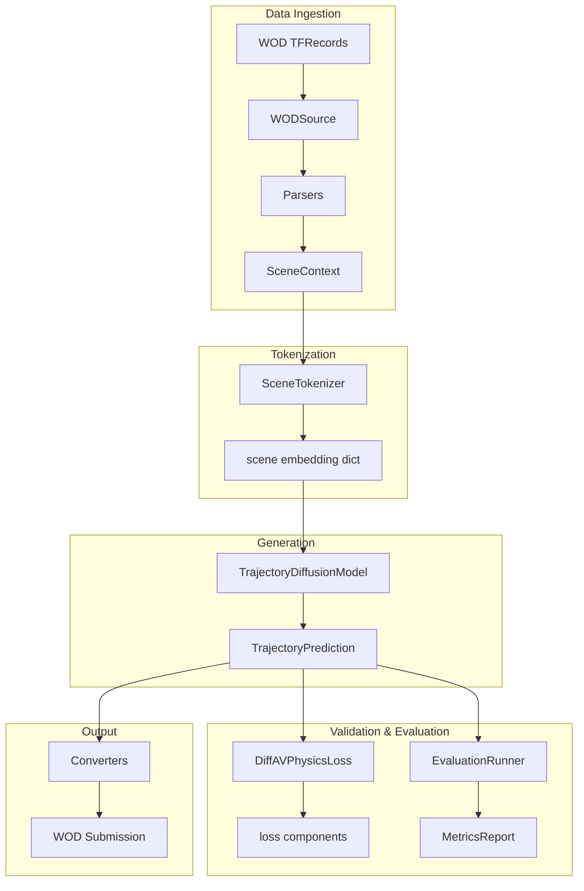
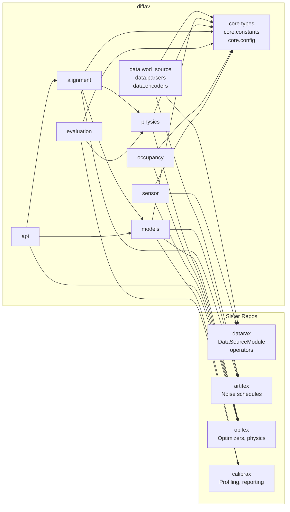

# Architecture

DiffAV is structured as a modular evaluation pipeline for autonomous driving,
built on the JAX ecosystem with integration across four sister repositories.

## High-Level Architecture



### Trajectory model architecture

The `TrajectoryDiffusionModel` node above is backed by a factorized design.
The denoiser is a `FactorizedSceneBackbone` that interleaves separate temporal
and social attention blocks, configured by `num_blocks`, `num_temporal_layers`,
and `num_social_layers`. Map conditioning is applied through adaLN-gated
cross-attention to scene tokens, enabled by `use_map_cross_attention`, with
`MapConditionedTrajectoryModel` serving as the map-conditioned entrypoint.
Diffusion is performed in per-agent local frames: the denoiser predicts in each
agent's own local frame, with one context row per agent.

## Module Dependency Graph



## Design Principles

### Consumer-Side Decoupling

The one seam where the pipeline consumes an abstract model — the evaluation
runner — is typed by the `TrajectorySampler` protocol defined next to its
consumer in `evaluation.runner`. Any object with a matching `sample` method
can be evaluated, which enables:

- Swapping model architectures without changing evaluation code
- Testing with lightweight stub samplers
- No speculative interfaces: abstractions exist only where consumed

### Immutable Data Flow

All domain types are frozen dataclasses. Data flows through the pipeline as
immutable snapshots, enabling:

- Safe concurrent processing
- Reproducible pipeline runs
- Clear ownership semantics

### JAX/TF Coexistence

TensorFlow is used **only** for WOD TFRecord parsing on CPU. GPU visibility
is disabled before any TF operation to prevent memory conflicts with JAX:

```python
import tensorflow as tf
tf.config.set_visible_devices([], "GPU")
```

### datarax Integration

`WODSource` extends `DataSourceModule` from datarax, following the
`TFDSEagerSource`/`TFDSStreamingSource` pattern:

- Standard `Element` iteration (data + state + metadata)
- Two loading modes: eager (all-at-init) and streaming (lazy prefetch)
- TFRecord parsing with Waymax-compatible temporal aggregation
- `StructuralConfig` validation pattern
- Compatibility with datarax batchers, operators, and the pipeline API
