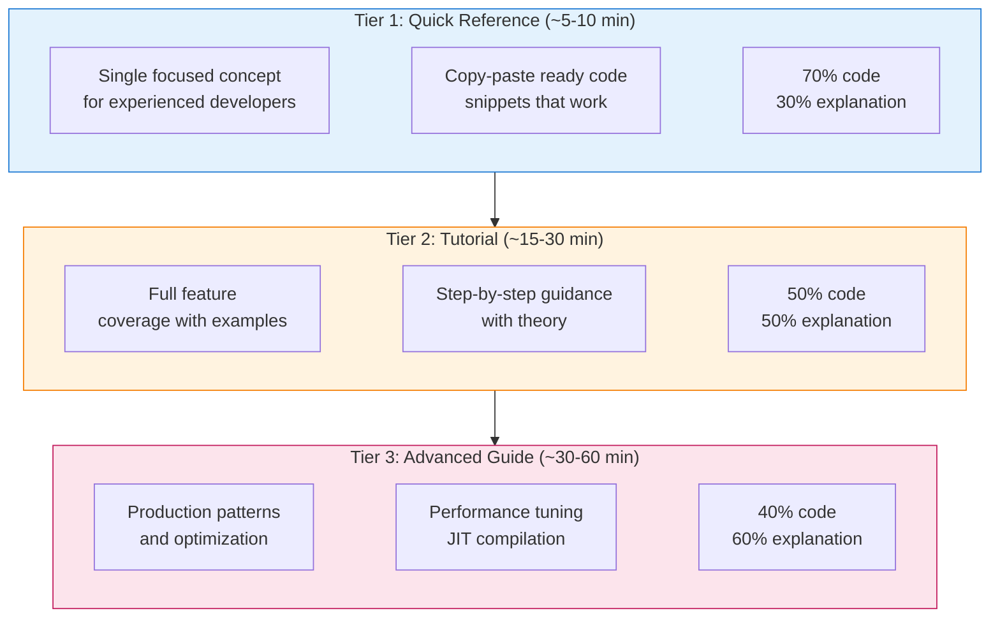
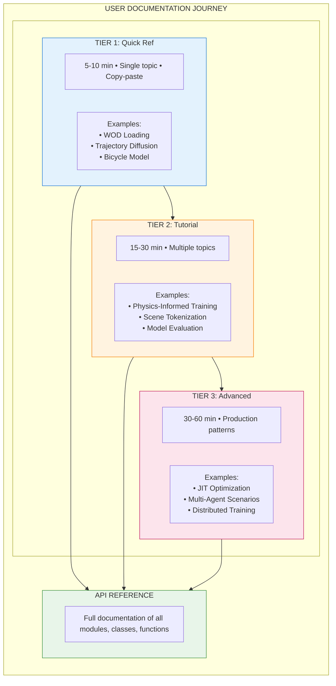
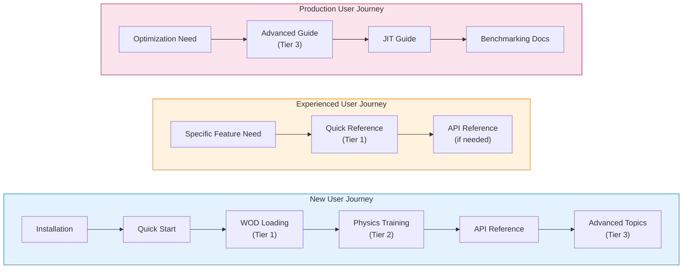
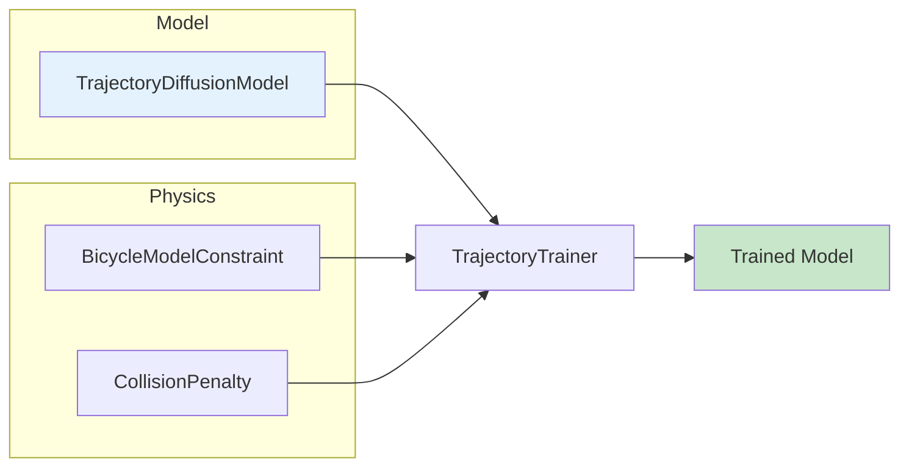
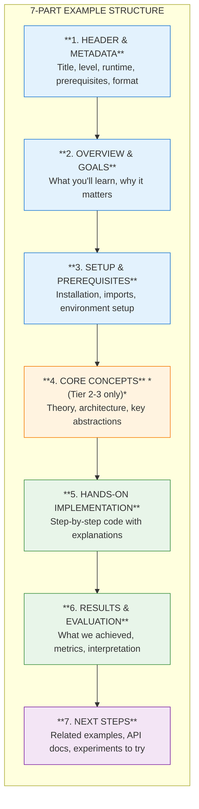
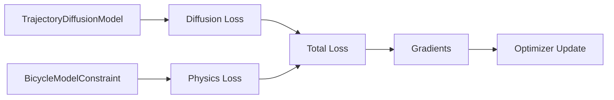
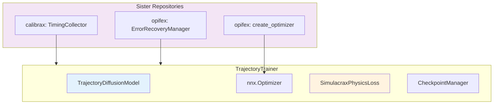
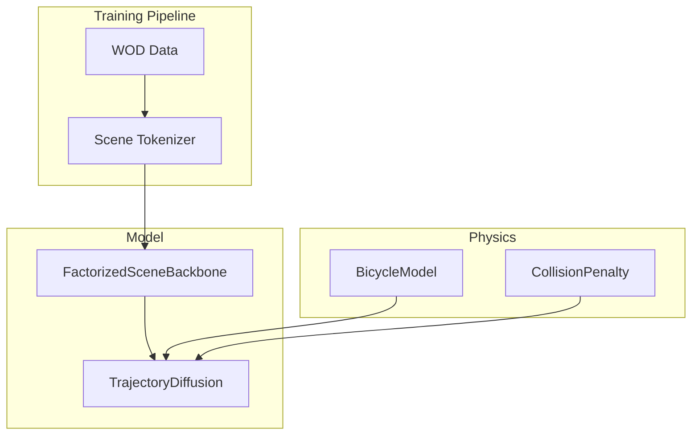
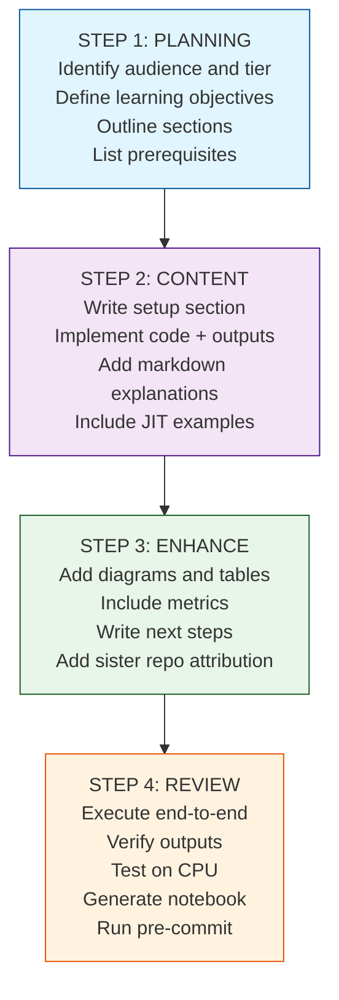

# Example Documentation Design Framework

> **Purpose**: Establish unified standards for creating educational examples and tutorials
> for the Simulacrax autonomous driving trajectory generation library.

---

## Table of Contents

1. [Executive Summary](#1-executive-summary)
2. [Design Philosophy](#2-design-philosophy)
3. [Documentation Architecture](#3-documentation-architecture)
4. [Documentation Location Strategy](#4-documentation-location-strategy)
5. [Dual-Format Implementation](#5-dual-format-implementation)
6. [Output Capture Requirements](#6-output-capture-requirements)
7. [Framework Migration Guides](#7-framework-migration-guides)
8. [Content Principles](#8-content-principles)
9. [Visual Design System](#9-visual-design-system)
10. [Documentation Tiers](#10-documentation-tiers)
11. [Component Library](#11-component-library)
12. [Writing Guidelines](#12-writing-guidelines)
13. [Code Example Standards](#13-code-example-standards)
14. [Implementation Workflow](#14-implementation-workflow)
15. [Quality Checklist](#15-quality-checklist)
16. [Examples Demonstrating Principles](#16-examples-demonstrating-principles)
17. [Maintenance & Updates](#17-maintenance-updates)
18. [Quick Reference Summary](#18-quick-reference-summary)

---

## 1. Executive Summary

### Purpose

This document defines complete standards for documenting Simulacrax examples and
tutorials. It ensures consistent, high-quality educational content that serves users
from first-time learners to production engineers building autonomous driving
trajectory generation systems.

### Three Core Objectives

| Objective | Description |
|-----------|-------------|
| **Educational Excellence** | Clear explanations with measurable learning outcomes for trajectory generation concepts |
| **Visual Appeal** | Beautiful, consistent presentation using Material for MkDocs |
| **Practical Utility** | Copy-paste ready code that runs successfully with JAX/Flax NNX |

### Three Documentation Tiers



---

## 2. Design Philosophy

### Five Core Principles

These principles guide every documentation decision in Simulacrax:

#### 2.1 Progressive Disclosure

**Start simple, add complexity gradually.**

Users should be able to build a working trajectory model with minimal code, then
progressively add physics constraints, JIT compilation, checkpointing, and
scene conditioning as they understand each concept.

```python
# Level 1: Minimal trajectory model (3 lines)
from simulacrax.models import TrajectoryDiffusionModel, TrajectoryDiffusionConfig

model = TrajectoryDiffusionModel(config, rngs=nnx.Rngs(params=jax.random.key(0)))

# Level 2: Add physics-informed training
trainer = TrajectoryTrainer(model, TrainerConfig(physics_config=physics_config))
metrics = trainer.train_step(trajectories, scene_context, key=key)

# Level 3: Add JIT compilation for performance
jit_step = nnx.jit(trainer.compute_train_step)
total_loss, aux = jit_step(trainer.model, trainer.optimizer, traj, ctx, key)

# Level 4: Production pipeline with checkpointing and adaptive physics
trainer = TrajectoryTrainer(model, TrainerConfig(
    physics_config=physics_config,
    checkpoint_config=CheckpointConfig(save_interval_steps=1000),
))
all_metrics = trainer.train(data_fn, key=key, road_edges=road_edges)
```

**Application in Documentation**:

- Quick Reference shows Level 1-2 only
- Tutorials progress through Level 1-3
- Advanced Guides cover Level 3-4 with production considerations

#### 2.2 Learning by Doing

**Every concept has runnable trajectory code.**

Theory sections should be concise. Users learn trajectory generation by building
models and running training loops, not by reading about them. Every theoretical
concept should be immediately followed by executable code.

`````markdown
<!-- Theory (brief) -->
## Understanding Bicycle Model Constraints

The bicycle model enforces realistic vehicle dynamics by checking position,
heading, acceleration, steering angle, and velocity constraints. Controls
are derived from finite differences—no explicit control inputs required.

<!-- Practice (immediate) -->
## Try It: Computing Kinematic Residuals

```python
# Create constraint and compute residual on a trajectory
constraint = BicycleModelConstraint(BicycleModelConfig())
residual = constraint.compute_residuals(trajectories)
print(f"Kinematic residual: {float(residual):.6f}")
```
`````

#### 2.3 Multiple Learning Paths

**Different users have different needs.**

| User Type | Needs | Best Tier |
|-----------|-------|-----------|
| Experienced ML engineer | Quick syntax reminder | Tier 1 Quick Reference |
| First-time Simulacrax user | Guided learning path | Tier 2 Tutorial |
| Production engineer | JIT optimization, scaling | Tier 3 Advanced Guide |
| Researcher exploring | Conceptual understanding | Tier 2 with theory focus |

**Documentation should support all paths without forcing users through unnecessary content.**

#### 2.4 Beautiful and Functional

**Visual design serves learning, not decoration.**

Good visual design reduces cognitive load and helps users understand relationships
between concepts. Simulacrax documentation uses Material for MkDocs features purposefully:

| Element | Purpose | Example Usage |
|---------|---------|---------------|
| Cards | Group related quick-start options | Example overview page |
| Callouts | Highlight important information | Warnings about JIT retracing |
| Tables | Compare options or show specifications | Model hyperparameters |
| Code blocks | Executable examples with highlighting | All code examples |
| Mermaid diagrams | Show model architecture and training flow | Trainer composition diagram |

#### 2.5 Trust Through Transparency

**Users should know exactly what to expect.**

Every example should clearly communicate:

- **Runtime estimate**: "~5 min (CPU)"
- **Memory requirements**: "~2 GB RAM"
- **Prerequisites**: Links to required background knowledge
- **Device compatibility**: CPU/GPU/TPU support status
- **Expected output**: Comments showing what users will see

```python
# Expected output:
# Model created: 64d, 2 layers
# Step   0 | total=1.2345 | diff=1.2300 | phys=0.0045 | grad=0.5678
# Step   5 | total=0.9876 | diff=0.9850 | phys=0.0026 | grad=0.4321
```

---

## 3. Documentation Architecture

### Three-Tier System Overview



### When to Use Each Tier

| Scenario | Recommended Tier | Rationale |
|----------|------------------|-----------|
| "How do I create a trajectory diffusion model?" | Tier 1 | Single concept, quick answer |
| "Never used Simulacrax before" | Tier 2 | Needs guided introduction |
| "How do I JIT-compile physics-informed training?" | Tier 3 | Complex production topic |
| "What physics constraints are available?" | Tier 2 | Overview of multiple concepts |
| "How do I debug NaN gradients in training?" | Tier 3 | Requires deep understanding |

### User Journey Through Documentation



---

## 4. Documentation Location Strategy

### Directory Structure

Simulacrax separates documentation from code, following a clean pattern where markdown
files in `docs/examples/` explain and link to runnable code in `examples/`:

```text
simulacrax/
├── docs/
│   └── examples/
│       ├── overview.md                      # Entry point with cards
│       ├── core/
│       │   └── wod-loading-quickref.md      # Docs for WOD loading
│       │
│       ├── models/
│       │   ├── trajectory-diffusion-quickref.md
│       │   └── physics-informed-training-tutorial.md
│       │
│       ├── physics/
│       │   └── bicycle-model-quickref.md
│       │
│       └── advanced/
│           ├── jit-optimization-guide.md
│           └── multi-agent-guide.md
│
├── examples/                                # Runnable code files
│   ├── _templates/
│   │   └── example_template.py              # Template for new examples
│   │
│   ├── core/
│   │   ├── 01_wod_loading_quickref.py       # Tier 1: WOD loading
│   │   └── 01_wod_loading_quickref.ipynb    # Generated notebook
│   │
│   ├── models/
│   │   ├── 01_trajectory_diffusion_quickref.py    # Tier 1: Model
│   │   ├── 01_trajectory_diffusion_quickref.ipynb
│   │   ├── 02_physics_informed_training_tutorial.py  # Tier 2: Training
│   │   └── 02_physics_informed_training_tutorial.ipynb
│   │
│   └── physics/
│       ├── 01_bicycle_model_quickref.py     # Tier 1: Kinematics
│       └── 01_bicycle_model_quickref.ipynb
│
└── mkdocs.yml                               # Navigation configuration
```

### File Naming Conventions

| Location | Pattern | Example |
|----------|---------|---------|
| `docs/examples/` | `kebab-case.md` | `bicycle-model-quickref.md` |
| `examples/` | `NN_snake_case.py` | `01_bicycle_model_quickref.py` |
| `examples/` | `NN_snake_case.ipynb` | `01_bicycle_model_quickref.ipynb` |

### Relationship Between `docs/examples/` and `examples/`

```text
docs/examples/               # Documentation (markdown files)
    └── physics/
        └── bicycle-model-quickref.md     # Explains the example, links to code

examples/                    # Runnable code (Python + Jupyter)
    └── physics/
        ├── 01_bicycle_model_quickref.py      # Source file with Jupytext markers
        └── 01_bicycle_model_quickref.ipynb   # Generated notebook
```

**Key Principle**: Documentation and code are separated. Markdown files in
`docs/examples/` explain concepts and link to the actual code in `examples/`.

### Documentation Page Structure

Each markdown file in `docs/examples/` follows this pattern:

`````markdown
# Bicycle Model Quick Reference

**Level:** Intermediate | **Runtime:** ~5 min | **Format:** Python + Jupyter

## Overview

[Description of what this example demonstrates]

## What You'll Learn

- [Learning goal 1]
- [Learning goal 2]
- [Learning goal 3]

## Files

- **Python Script**: [`examples/physics/01_bicycle_model_quickref.py`](https://github.com/avitai/simulacrax/blob/main/examples/physics/01_bicycle_model_quickref.py)
- **Jupyter Notebook**: [`examples/physics/01_bicycle_model_quickref.ipynb`](https://github.com/avitai/simulacrax/blob/main/examples/physics/01_bicycle_model_quickref.ipynb)

## Quick Start

### Run the Python Script

```bash
python examples/physics/01_bicycle_model_quickref.py
```

### Run the Jupyter Notebook

```bash
jupyter lab examples/physics/01_bicycle_model_quickref.ipynb
```

## Key Concepts

[Explanation of concepts demonstrated in this example]

## Example Code

```python
[Key code snippets from the example]
```

## Next Steps

- [Link to related example]
- [Link to API reference]
`````

**Guidelines**:

- `docs/examples/` contains **markdown files only** that explain examples
- `examples/` contains **all runnable code** (`.py` and `.ipynb` files)
- Markdown files link to code via GitHub URLs for easy navigation
- The `.py` file is the source of truth; `.ipynb` is generated via Jupytext
- Keep documentation and code in sync when making changes

---

## 5. Dual-Format Implementation

### Philosophy

Simulacrax examples use a **dual-format approach**:

1. **Python scripts (`.py`)** as the source of truth
2. **Jupyter notebooks (`.ipynb`)** generated automatically via Jupytext

This ensures code is:

- Version-controllable (clean diffs in `.py` files)
- IDE-friendly (full Python tooling support)
- Interactive (Jupyter for exploration)
- Consistent (single source, two formats)

### Jupytext Header Format

Every Python example file MUST include a Jupytext header:

```python
# ---
# jupyter:
#   jupytext:
#     formats: py:percent,ipynb
#     text_representation:
#       extension: .py
#       format_name: percent
#       format_version: '1.3'
# ---
```

### Cell Marker Format

```python
# %% [markdown]
"""
# Title of Section

Markdown content goes here with **formatting**, `code`, and lists:

- Item 1
- Item 2
"""

# %%
# Python code cell
import jax
print("This is executable code")

# %% [markdown]
"""
## Another Markdown Section

More explanation here.
"""
```

### Best Practices for Dual-Format Examples

#### DO

```python
# %% [markdown]
"""
## Step 1: Create Trajectory Model

We create a `TrajectoryDiffusionModel` with a small config for demonstration.
"""

# %%
# Create model with demonstration-scale config
model = TrajectoryDiffusionModel(config, rngs=nnx.Rngs(params=jax.random.key(0)))
print(f"Model: {config.hidden_dim}d, {config.num_blocks} blocks")
# Expected output:
# Model: 64d, 2 blocks
```

#### DON'T

```python
# Bad: Mixing markdown and code without cell markers
# This is an explanation (should be in markdown cell)
model = TrajectoryDiffusionModel(config, rngs=rngs)

# Bad: Long inline comments instead of markdown
# This creates a trajectory diffusion model which uses a FactorizedSceneBackbone
# to generate future trajectories conditioned on scene context
# via the denoising diffusion probabilistic model framework...
```

### Conversion Workflow

```bash
# Convert Python script to notebook
python scripts/jupytext_converter.py py-to-nb examples/models/01_trajectory_diffusion_quickref.py

# Batch convert directory
python scripts/jupytext_converter.py batch-py-to-nb examples/models/

# Watch for changes and auto-convert
python scripts/jupytext_converter.py watch examples/
```

### Synchronization Checklist

Before committing example changes:

- [ ] Python file has Jupytext header
- [ ] Cell markers properly separate code and markdown
- [ ] Notebook is regenerated from Python source
- [ ] Both files are staged for commit
- [ ] Code runs successfully as both `.py` and `.ipynb`

---

## 6. Output Capture Requirements

### Purpose

Each markdown documentation file (`docs/examples/*.md`) MUST include captured outputs
for code examples. This ensures:

- **Reproducibility**: Users can verify their output matches expected behavior
- **Debugging**: Easier to identify when something goes wrong
- **Self-contained documentation**: No need to run code to understand results

### Terminal Output Capture

Every code block that produces output must be followed by the captured terminal output:

````markdown
```python
print(f"Trajectories: {trajectories.shape}")
print(f"Kinematic residual: {float(residual):.6f}")
```

**Terminal Output:**
```
Trajectories: (32, 80, 4)
Kinematic residual: 0.001234
```
````

**Guidelines:**

- Capture actual output from running the code
- Include all relevant print statements
- Show shapes, dtypes, and value ranges for verification
- For variable outputs, note the expected format: "Output varies by hardware"

### Visualization Capture

All plots, charts, and visual outputs must be saved and embedded:

**Saving visualizations:**

```python
import matplotlib.pyplot as plt

# Create training loss visualization
fig, ax = plt.subplots(figsize=(8, 4))
ax.plot([m.total_loss for m in metrics_history], label="Total Loss")
ax.plot([m.diffusion_loss for m in metrics_history], label="Diffusion Loss")
ax.plot([m.physics_loss for m in metrics_history], label="Physics Loss")
ax.set_xlabel("Step")
ax.set_ylabel("Loss")
ax.legend()
ax.set_title("Physics-Informed Training Loss Curves")

# Save at 150 DPI for documentation
plt.savefig('docs/assets/images/examples/training-loss-curves.png', dpi=150, bbox_inches='tight')
plt.close()
```

**Embedding in markdown:**

```markdown

```

### Image Naming Conventions

Store all example images in `docs/assets/images/examples/` with consistent naming:

| Category | Prefix | Examples |
|----------|--------|----------|
| Trajectory | `traj-` | `traj-sampled-predictions.png`, `traj-diffusion-steps.png` |
| Physics | `phys-` | `phys-kinematic-residuals.png`, `phys-collision-heatmap.png` |
| Training | `train-` | `train-loss-curves.png`, `train-adaptive-weight.png` |
| Scene | `scene-` | `scene-tokenized-context.png`, `scene-map-encoding.png` |
| Performance | `perf-` | `perf-jit-speedup.png`, `perf-scaling-agents.png` |

### Output Requirements by Tier

| Tier | Terminal Output | Visualizations | Architecture Diagrams |
|------|-----------------|----------------|----------------------|
| Tier 1: Quick Reference | Required | 1-2 sample plots | Optional |
| Tier 2: Tutorial | Required (each step) | 3-4 visualizations | 1 Mermaid diagram |
| Tier 3: Advanced Guide | Required | Performance plots, profiles | Architecture diagrams |

### Mermaid Diagrams

Use Mermaid for architecture and flow diagrams (renders in MkDocs):

````markdown

````

---

## 7. Framework Migration Guides

### Purpose

Many Simulacrax users come from other motion planning or trajectory prediction
frameworks. Each example should include "Coming from X?" sections that map familiar
concepts to Simulacrax equivalents.

### Required Migration Sections

Each markdown documentation file should include comparison tables for relevant frameworks:

````markdown
## Coming from MotionDiffuser / Diffuser?

If you're familiar with Diffuser-style trajectory models, here's how Simulacrax compares:

| Diffuser | Simulacrax |
|----------|------------|
| `GaussianDiffusion(model)` | `TrajectoryDiffusionModel(config, rngs=rngs)` |
| `model.p_losses(x_start, t)` | `model.compute_loss(trajectories, scene_context, key=key)` |
| `model.p_sample_loop(shape)` | `model.sample(scene_context, key=key)` |
| PyTorch `nn.Module` | Flax NNX `nnx.Module` |
| `optimizer.step()` | `optimizer.update(model, grads)` |

**Key differences:**

1. **JAX-native**: All operations use JAX arrays and JIT compilation, not PyTorch tensors
2. **Scene conditioning**: Models are conditioned on tokenized scene context (map, agents, sensors)
3. **Physics-informed**: Training integrates bicycle model constraints and collision penalties
4. **Functional transforms**: Uses explicit PRNG keys for reproducible sampling

## Coming from MTR / Scene Transformer?

| MTR/Scene Transformer | Simulacrax |
|----------------------|------------|
| PyTorch transformer backbone | `FactorizedSceneBackbone` (Flax NNX) |
| Goal-conditioned prediction | Scene-conditioned diffusion |
| Anchor trajectories + refinement | Iterative denoising from noise |
| `torch.utils.data.DataLoader` | `WODSource` + datarax pipeline |

## Coming from UniSim / GAIA-1?

| UniSim/GAIA-1 | Simulacrax |
|---------------|------------|
| Full world model (video + trajectory) | Trajectory-focused generation |
| Autoregressive generation | Diffusion-based generation |
| Image-space rendering | State-space trajectories [x, y, heading, velocity] |
| Proprietary infrastructure | Open JAX/Flax NNX stack |
````

### Framework Mapping Reference

Use this reference when creating migration sections:

#### Data Sources

| Concept | PyTorch Ecosystem | TensorFlow Ecosystem | Simulacrax |
|---------|-------------------|----------------------|------------|
| WOD loading | `waymo_open_dataset` | `tf.data` + WOD protos | `WODSource` |
| Scene parsing | Custom proto parsing | Custom proto parsing | `SceneParser` |
| Tokenization | Manual feature extraction | Manual feature extraction | `SceneTokenizer` |

#### Models

| Concept | PyTorch | Simulacrax |
|---------|---------|------------|
| Transformer backbone | `nn.TransformerEncoder` | `FactorizedSceneBackbone` (NNX) |
| Diffusion model | `GaussianDiffusion` | `TrajectoryDiffusionModel` |
| Training loop | `for batch in loader: ...` | `TrajectoryTrainer.train()` |
| JIT compilation | `torch.compile(model)` | `nnx.jit(trainer.compute_train_step)` |

#### Physics

| Concept | Custom Implementation | Simulacrax |
|---------|----------------------|------------|
| Vehicle kinematics | Manual bicycle model | `BicycleModelConstraint` |
| Collision checking | Pairwise distance | `SimulacraxPhysicsLoss` (collision penalty) |
| Constraint enforcement | Custom loss terms | `SimulacraxPhysicsLoss` (adaptive weighting) |

### When to Include Migration Sections

| Example Category | Include Diffuser? | Include MTR? | Include UniSim? |
|------------------|-------------------|--------------|-----------------|
| Trajectory model | Yes | Yes | No |
| Physics constraints | No | No | No |
| Training loop | Yes | Yes | No |
| Scene tokenization | No | Yes | Yes |
| JIT optimization | No | No | No |

---

## 8. Content Principles

### The 7-Part Structure

Every Simulacrax example follows this structure, adapted by tier:



### Part 1: Header & Metadata

```markdown
# Bicycle Model Quick Reference

| Metadata | Value |
|----------|-------|
| **Level** | Intermediate |
| **Runtime** | ~5 min (CPU) |
| **Prerequisites** | JAX arrays, vehicle kinematics basics |
| **Format** | Python + Jupyter |
```

**Metadata Fields**:

| Field | Required | Options/Format |
|-------|----------|----------------|
| Level | Yes | Beginner / Intermediate / Advanced |
| Runtime | Yes | ~X min (CPU) / ~Y min (GPU) |
| Prerequisites | Yes | Links to prior knowledge |
| Format | Yes | Python + Jupyter |
| Memory | Recommended | ~X GB RAM |
| Devices | Optional | CPU / GPU / TPU |

### Part 2: Overview & Goals

```markdown
## Overview

This quick reference demonstrates building physics-informed kinematic constraints
for trajectory validation. You'll create a bicycle model constraint, compute
residuals on vehicle trajectories, and validate against kinematic limits—the
core workflow for enforcing physical plausibility in generated trajectories.

## Learning Goals

By the end of this example, you will be able to:

1. Create a `BicycleModelConstraint` with vehicle dynamics parameters
2. Compute kinematic residuals on trajectory arrays
3. Validate trajectories against acceleration and steering limits
4. Use the Ackerman steering constraint for turning radius checks
```

**Guidelines for Learning Goals**:

- Use action verbs: Create, Build, Implement, Configure, Debug, Optimize
- Be specific and measurable
- Limit to 3-5 goals per example
- Tier 1: 2-3 goals, Tier 2: 4-5 goals, Tier 3: 4-6 goals

### Part 3: Setup & Prerequisites

````markdown
## Setup

```bash
# Install simulacrax with development dependencies
uv sync
```

**Estimated Time**: 5-10 minutes


```python
# %%
# Imports
import jax
import jax.numpy as jnp
from flax import nnx

from simulacrax.models import TrajectoryDiffusionModel, TrajectoryDiffusionConfig
from simulacrax.physics.kinematics import BicycleModelConstraint, BicycleModelConfig
```
````

### Part 4: Core Concepts (Tier 2-3)

For tutorials and advanced guides, include theoretical background:

````markdown
## Core Concepts

### The Diffusion Training Loop

Simulacrax training combines diffusion noise prediction loss with physics-informed
penalties in a single backward pass. The trainer composes building blocks from
sister repositories:



### Adaptive Physics Weighting

| Phase | Physics Weight | Purpose |
|-------|----------------|---------|
| Early training | Low (0.01) | Learn data distribution first |
| Mid training | Increasing | Gradually enforce constraints |
| Late training | High (1.0) | Full physical plausibility |

````

### Part 5: Hands-On Implementation

This is the main content section with step-by-step code:

````markdown
## Implementation

### Step 1: Create Synthetic Trajectories

Trajectories have state `[x, y, heading, velocity]` at each timestep.
Controls are derived via finite differences—no explicit inputs required.

```python
# %%
# Create straight-line trajectories at 10 m/s
num_agents = 32
future_steps = 80
t = jnp.arange(future_steps) * 0.1
x = jnp.broadcast_to(t * 10.0, (num_agents, future_steps))
y = jnp.zeros((num_agents, future_steps))
heading = jnp.zeros((num_agents, future_steps))
velocity = jnp.full((num_agents, future_steps), 10.0)
trajectories = jnp.stack([x, y, heading, velocity], axis=-1)

print(f"Trajectories: {trajectories.shape}")
# Expected output:
# Trajectories: (32, 80, 4)
```
````

### Part 6: Results & Evaluation

```markdown
## Results Summary

| Component | Description |
|-----------|-------------|
| Model | TrajectoryDiffusionModel with 64d hidden, 2 layers |
| Physics | Bicycle model + collision penalty |
| Training | 20 steps with adaptive physics weighting |
| JIT | 2-10x speedup with `nnx.jit` |

### What We Achieved

- Created a physics-informed training loop from scratch
- Demonstrated adaptive weight scheduling across epochs
- Verified JIT compilation produces identical results with better performance

### Interpretation

The physics loss gradually increases its contribution during training,
allowing the diffusion model to first learn the data distribution before
enforcing kinematic plausibility. This avoids the training instability
that occurs when physics constraints dominate early optimization.
```

### Part 7: Next Steps

```markdown
## Next Steps

### Try These Experiments

1. Increase `num_agents` to 64 and observe collision penalty changes
2. Add road boundary constraints via the `road_edges` parameter
3. Switch to exponential weight scheduling and compare convergence

### Related Examples

- [Bicycle Model Quick Reference](../examples/physics/bicycle-model-quickref.md) - Kinematic constraint details
- [Trajectory Diffusion Quick Reference](../examples/models/trajectory-diffusion-quickref.md) - Model architecture
- [WOD Loading Quick Reference](../examples/core/wod-loading-quickref.md) - Real dataset loading

### API Reference

- [`TrajectoryDiffusionModel`](../api/models/trajectory_diffusion.md) - Diffusion model
- [`TrajectoryTrainer`](../api/models/trainer.md) - Training coordinator
- [`BicycleModelConstraint`](../api/physics/kinematics.md) - Vehicle kinematics
```

---

## 9. Visual Design System

### Design Tokens

Simulacrax documentation uses Material for MkDocs with these design choices:

| Token | Value | Usage |
|-------|-------|-------|
| Primary Color | Indigo | Headers, links, emphasis |
| Accent Color | Amber | Interactive elements, highlights |
| Code Font | Roboto Mono | All code blocks |
| Text Font | Roboto | Body text, headers |

### Material Design Cards

Use cards for navigation and feature highlights:

````markdown
<div class="grid cards" markdown>

-   :material-car:{ .lg .middle } **Trajectory Diffusion**

    ---

    Build and sample from diffusion models for trajectory generation

    [:octicons-arrow-right-24: Quick Reference](../examples/models/trajectory-diffusion-quickref.md)

-   :material-car-brake-abs:{ .lg .middle } **Bicycle Model**

    ---

    Validate trajectories against vehicle kinematic constraints

    [:octicons-arrow-right-24: Quick Reference](../examples/physics/bicycle-model-quickref.md)

</div>
````

### Callout Boxes

Use admonitions for different information types:

```markdown
!!! note "Key Concept"
    Trajectories use state `[x, y, heading, velocity]` without explicit controls.
    Accelerations and steering angles are derived via finite differences.

!!! tip "Performance Tip"
    Wrap `compute_train_step` with `nnx.jit` for 2-10x speedup on GPU/TPU.
    The first call includes compilation overhead; subsequent calls are fast.

!!! note "Traced Epoch"
    `epoch` is a traced argument of `compute_train_step`, so the adaptive
    physics weight advances across epochs under a single compiled function
    — no retracing.

!!! danger "NaN Detection"
    When NaN is detected in loss or gradients, the trainer zeros all gradients
    and skips the optimizer update. Check your data for invalid values.

!!! example "Try It"
    Modify the `physics_config` parameters and observe how loss curves change.

!!! info "Sister Repository"
    The optimizer is created via opifex's `create_optimizer`. See the
    [opifex documentation](https://github.com/avitai/opifex) for advanced options.
```

### Code Blocks

Always use syntax highlighting and copy buttons:

````markdown
```python title="Creating a Trajectory Model" linenums="1"
from simulacrax.models import TrajectoryDiffusionModel, TrajectoryDiffusionConfig

config = TrajectoryDiffusionConfig(hidden_dim=256, num_blocks=4)
model = TrajectoryDiffusionModel(config, rngs=nnx.Rngs(params=jax.random.key(0)))
```
````

For code with annotations:

````markdown
```python
jit_step = nnx.jit(trainer.compute_train_step)  # (1)!
```

1. `nnx.jit` wraps the bound method. Model and optimizer are passed as explicit
    arguments (NNX-traced), while physics config and epoch are captured in the
    closure as static compile-time constants.
````

### Mermaid Diagrams

For trainer architecture visualization:

````markdown

````

---

## 10. Documentation Tiers

### Tier 1: Quick Reference

#### Specification

| Attribute | Value |
|-----------|-------|
| **Target Audience** | Experienced developers needing quick syntax lookup |
| **Length** | 100-200 lines of code |
| **Time to Complete** | 5-10 minutes |
| **Code/Explanation Ratio** | 70% code / 30% explanation |
| **Prerequisites** | Working Simulacrax knowledge |

#### Structure Template

````python
# ---
# jupyter:
#   jupytext:
#     formats: py:percent,ipynb
#     text_representation:
#       extension: .py
#       format_name: percent
#       format_version: '1.3'
# ---

# %% [markdown]
"""
# [Feature] Quick Reference

| Metadata | Value |
|----------|-------|
| **Level** | Beginner / Intermediate |
| **Runtime** | ~5 min (CPU) |
| **Prerequisites** | [Prerequisite](link) |
| **Format** | Python + Jupyter |

## Overview

[1-2 sentences describing the feature]
"""

# %%
# Imports
import jax
import jax.numpy as jnp
from flax import nnx
# ... minimal imports

# %% [markdown]
"""
## 1. [First Concept]

[Brief explanation]
"""

# %%
# Core functionality - copy-paste ready
# ... working code with expected output comments

# %% [markdown]
"""
## 2. [Second Concept]
"""

# %%
# Pattern implementation

# %% [markdown]
"""
## Summary

| Feature | API |
|---------|-----|
| [Feature 1] | `ClassName.method()` |
| [Feature 2] | `function_name()` |

All operations are vectorized JAX, JIT-compatible, and differentiable.
"""
````

#### Tier 1 Exemplar: Bicycle Model Quick Reference

Reference: [`examples/physics/01_bicycle_model_quickref.py`](https://github.com/avitai/simulacrax/blob/main/examples/physics/01_bicycle_model_quickref.py)

This example demonstrates ideal Tier 1 structure:

- Concise metadata table
- Clear, measurable learning goals
- Minimal setup section
- Step-by-step implementation with expected outputs
- Summary table mapping features to API
- All operations verified as JIT-compatible and differentiable

### Tier 2: Tutorial

#### Specification

| Attribute | Value |
|-----------|-------|
| **Target Audience** | First-time learners of a feature |
| **Length** | 200-400 lines |
| **Time to Complete** | 15-30 minutes |
| **Code/Explanation Ratio** | 50% code / 50% explanation |
| **Prerequisites** | Basic Simulacrax, relevant domain knowledge |

#### Structure Template

````python
# ---
# jupyter:
#   jupytext:
#     formats: py:percent,ipynb
#     text_representation:
#       extension: .py
#       format_name: percent
#       format_version: '1.3'
# ---

# %% [markdown]
"""
# [Feature] Tutorial

| Metadata | Value |
|----------|-------|
| **Level** | Intermediate |
| **Runtime** | ~15 min (CPU) |
| **Prerequisites** | [Prerequisite 1](link), [Prerequisite 2](link) |
| **Format** | Python + Jupyter |

## Overview

[2-3 paragraphs explaining what this tutorial covers and why it matters]
"""

# %% [markdown]
"""
## 1. Create Model and Config

[Explanation of model setup]
"""

# %%
# Model setup code

# %% [markdown]
"""
## 2. Configure Training

[Explanation of training configuration, composing sister repo components]
"""

# %%
# Training configuration code

# %% [markdown]
"""
## 3. [Core Section]

[Detailed explanation with theory]

| Component | Source | Purpose |
|-----------|--------|---------|
| [Component] | [Repo] | [Role] |
"""

# %%
# Implementation

# %% [markdown]
"""
## N. JIT-Compiled Training

The `compute_train_step` method is JIT-compatible via `nnx.jit`.
Wrapping with JIT triggers XLA compilation, yielding **2-10x speedup**.
"""

# %%
# JIT demonstration
jit_step = nnx.jit(trainer.compute_train_step)

# %% [markdown]
"""
## Summary

| Component | Source | Purpose |
|-----------|--------|---------|
| [Component 1] | [sister repo] | [purpose] |
| [Component 2] | simulacrax | [purpose] |
"""
````

#### Tier 2 Exemplar: Physics-Informed Training Tutorial

Reference: [`examples/models/02_physics_informed_training_tutorial.py`](https://github.com/avitai/simulacrax/blob/main/examples/models/02_physics_informed_training_tutorial.py)

### Tier 3: Advanced Guide

#### Specification

| Attribute | Value |
|-----------|-------|
| **Target Audience** | Production engineers, expert users |
| **Length** | 400-800+ lines |
| **Time to Complete** | 30-60+ minutes |
| **Code/Explanation Ratio** | 40% code / 60% explanation |
| **Prerequisites** | Complete Tier 2 tutorials, JAX JIT experience |

#### Structure Template

````python
# ---
# jupyter:
#   jupytext:
#     formats: py:percent,ipynb
#     text_representation:
#       extension: .py
#       format_name: percent
#       format_version: '1.3'
# ---

# %% [markdown]
"""
# [Advanced Topic] Guide

| Metadata | Value |
|----------|-------|
| **Level** | Advanced |
| **Runtime** | ~30-60 min |
| **Prerequisites** | [Tutorial 1](link), [Tutorial 2](link), JAX JIT experience |
| **Format** | Python + Jupyter |
| **Memory** | ~4 GB RAM |
| **Devices** | GPU/TPU recommended |

## Overview

[Thorough overview of the advanced topic, including:
- What problem it solves
- When to use it (and when not to)
- Performance implications
- Production considerations]
"""

# %% [markdown]
"""
## Architecture Overview



### Design Decisions

[Explain architectural choices and tradeoffs]
"""

# %% Implementation sections follow...

# %% [markdown]
"""
## Performance Optimization

### JIT Compilation Strategy

| Strategy | When to Use | Expected Improvement |
|----------|-------------|---------------------|
| `nnx.jit(compute_train_step)` | Standard training | 2-10x speedup |
| Traced `epoch` argument | Physics weight changes | No retracing |
| Batch size tuning | Memory-constrained | Better GPU utilization |

### Benchmarking

```python
# Benchmark code
```
"""

# %% [markdown]
"""
## Troubleshooting

### Issue: JIT Retracing on Every Step

**Symptoms**:
- Slow training despite JIT wrapper
- "Tracing..." messages every step

**Diagnosis**: An argument's shape or dtype changes between calls

**Resolution**:
```python
# Keep argument shapes/dtypes stable across steps; epoch is traced,
# so passing a new epoch value does not retrace
jit_step(model, optimizer, traj, ctx, key, epoch)
```
"""
````

---

## 11. Component Library

### Reusable Documentation Components

These templates can be copied and adapted for new examples.

### Setup Section Template

```python
# %% [markdown]
"""
## Setup

### Installation

```bash
# Basic installation
uv pip install simulacrax

# With WOD data dependencies
uv pip install "simulacrax[data]"

# Development installation
uv sync
```

### Environment

```bash
# Optional: Configure JAX for specific device
export JAX_PLATFORM_NAME=gpu  # or cpu, tpu
```
"""

# %%
# Imports - organized by source

# Third-party
import jax
import jax.numpy as jnp
from flax import nnx

# Simulacrax
from simulacrax.models import TrajectoryDiffusionModel, TrajectoryDiffusionConfig
from simulacrax.physics.kinematics import BicycleModelConstraint, BicycleModelConfig

# Verify setup
print(f"JAX version: {jax.__version__}")
print(f"Devices: {jax.devices()}")
```

### Learning Objectives Template

```markdown
## Learning Goals

By the end of this example, you will be able to:

1. **Create** [specific outcome with Simulacrax component]
2. **Configure** [settings/parameters for specific use case]
3. **Implement** [working code pattern]
4. **Validate** [physics constraints or model outputs]
```

### Code Example Template

```python
# %% [markdown]
"""
### Step N: [Descriptive Title]

[1-2 sentences explaining what this step accomplishes and why it's needed]

!!! tip "Best Practice"
    [Optional tip for optimal implementation]
"""

# %%
# Step N: [Title]

# Configuration
config = BicycleModelConfig(
    wheelbase=2.7,          # metres
    dt=0.1,                 # 10 Hz
    max_acceleration=8.0,   # m/s^2
)

# Create component
constraint = BicycleModelConstraint(config)

# Use component
residual = constraint.compute_residuals(trajectories)

# Verify
print(f"Kinematic residual: {float(residual):.6f}")
print(f"All gradients finite: {bool(jnp.all(jnp.isfinite(jax.grad(constraint.compute_residuals)(trajectories))))}")

# Expected output:
# Kinematic residual: 0.001234
# All gradients finite: True
```

### Summary Template

```markdown
## Summary

| Feature | API |
|---------|-----|
| Kinematic residual | `BicycleModelConstraint.compute_residuals(traj)` |
| Trajectory validation | `BicycleModelConstraint.validate(traj)` |
| Turning radius | `AckermanSteeringConstraint.compute_min_turning_radius()` |

All operations are vectorized JAX, JIT-compatible, and differentiable.
```

### Next Steps Template

```markdown
## Next Steps

### Experiments to Try

1. **Increase agent count**: Try `num_agents=64` and observe collision penalty
2. **Add road edges**: Pass `road_edges` to `compute_loss`
3. **Switch schedule**: Compare linear vs exponential weight scheduling

### Related Examples

| Example | Level | What You'll Learn |
|---------|-------|-------------------|
| [Bicycle Model](link) | Intermediate | Kinematic constraints |
| [Training Tutorial](link) | Intermediate | Physics-informed training |
| [JIT Guide](link) | Advanced | Compilation optimization |

### API Reference

- [`TrajectoryDiffusionModel`](../api/models/trajectory_diffusion.md) - Diffusion model
- [`TrajectoryTrainer`](../api/models/trainer.md) - Training coordinator
- [`BicycleModelConstraint`](../api/physics/kinematics.md) - Vehicle kinematics
```

---

## 12. Writing Guidelines

### Voice and Tone

#### Educational

Write to teach, not to impress. Assume intelligence but not prior knowledge.

```markdown
<!-- Good -->
The bicycle model derives controls from finite differences. Given
position and heading at each timestep, it computes acceleration and
steering angle to check against physical limits.

<!-- Avoid -->
The kinematic constraint module leverages functional differentiation
paradigms to enforce Ackerman steering geometry compliance over
temporally-discretized state trajectories.
```

#### Encouraging

Acknowledge difficulty while providing clear paths forward.

```markdown
<!-- Good -->
JIT compilation with physics loss can be tricky. Let's start with a
simple model without physics, then add constraints once JIT works.

<!-- Avoid -->
This is trivial for anyone familiar with JAX JIT semantics.
```

#### Specific

Provide concrete numbers, not vague descriptions.

```markdown
<!-- Good -->
- Runtime: ~5 min on CPU
- Memory: ~2 GB RAM
- Speedup: ~5x with JIT on GPU

<!-- Avoid -->
- This runs quickly
- Requires moderate memory
- Much faster with JIT
```

#### Active Voice

Use active voice for clearer instructions.

```markdown
<!-- Good -->
Create a BicycleModelConstraint to validate trajectories.
The trainer computes gradients in a single backward pass.

<!-- Avoid -->
A BicycleModelConstraint should be created for trajectory validation.
Gradients are computed by the trainer in a single backward pass.
```

### Grammar and Style

| Rule | Example |
|------|---------|
| Capitalize proper nouns | "Simulacrax", "JAX", "Flax NNX" |
| Use code formatting for code | "`compute_loss()`", "`TrajectoryDiffusionModel`" |
| Use present tense | "The constraint validates" not "will validate" |

### Technical Terms

#### Simulacrax-Specific Terminology

| Term | Definition | Usage |
|------|------------|-------|
| Trajectory | Future states [x, y, heading, velocity] for an agent | "Generate trajectories conditioned on scene context" |
| Scene Context | Tokenized representation of the driving scene | "Scene context encodes map, agents, and sensors" |
| Diffusion Model | Denoising model that generates trajectories from noise | "The diffusion model iteratively refines noisy trajectories" |
| Physics Loss | Kinematic + collision penalties for physical plausibility | "Physics loss enforces bicycle model constraints" |
| Adaptive Weight | Schedule that increases physics contribution during training | "Adaptive weight starts at 0.01 and increases to 1.0" |
| Residual | Measure of kinematic constraint violation | "Lower residual means more physically plausible" |
| JIT Step | JIT-compiled training step for GPU/TPU performance | "Wrap `compute_train_step` with `nnx.jit`" |

#### Code Comment Standards

```python
# Good: Explain WHY, not WHAT
# Derive steering angle from heading differences (no explicit control inputs)
delta = jnp.arctan(dheading * wheelbase / (velocity * dt))

# Good: Note non-obvious behavior
# Physics config is captured as a static closure value; epoch is a traced argument
physics = self._physics

# Avoid: Redundant comments
# Create a config object
config = BicycleModelConfig()  # This is obvious
```

---

## 13. Code Example Standards

### Executable Code Philosophy

**All code in Simulacrax examples must be executable.**

- No pseudocode or placeholder syntax
- All imports must be real and available
- Expected outputs must match actual execution
- Examples should work on CPU (GPU optional for performance examples)

### Code Organization Patterns

#### Import Organization

```python
# Standard library (alphabetical)
import time
from collections.abc import Iterator

# Third-party (alphabetical)
import jax
import jax.numpy as jnp
from flax import nnx
from opifex.core.training.optimizers import OptimizerConfig

# Simulacrax (alphabetical by submodule)
from simulacrax.models import TrajectoryDiffusionModel, TrajectoryDiffusionConfig
from simulacrax.models.trainer import TrainerConfig, TrajectoryTrainer
from simulacrax.physics.kinematics import BicycleModelConstraint, BicycleModelConfig
from simulacrax.physics.losses import SimulacraxPhysicsConfig, SimulacraxPhysicsLoss
```

#### Configuration Examples

```python
# Explicit, documented configuration
model_config = TrajectoryDiffusionConfig(
    hidden_dim=64,          # Embedding dimension
    num_blocks=1,           # Factorized backbone blocks
    num_temporal_layers=1,  # Temporal attention sublayers per block
    num_social_layers=1,    # Social attention sublayers per block
    num_heads=2,            # Attention heads
    future_steps=16,        # Prediction horizon (timesteps)
    num_agents_max=8,       # Maximum agents per scene
    num_timesteps=20,       # Diffusion timesteps
    context_dim=32,         # Scene context dimension
)

# Training configuration with sister repo components
trainer_config = TrainerConfig(
    optimizer_config=OptimizerConfig(
        optimizer_type="adam",
        learning_rate=1e-3,
        gradient_clip=1.0,
    ),
    physics_config=SimulacraxPhysicsConfig(
        kinematic_weight=1.0,
        collision_weight=1.0,
        adaptive_weighting=True,
    ),
    num_epochs=5,
    log_interval=10,
)
```

### Sister Repository Attribution

When using components from sister repositories, always note their origin:

```python
# %% [markdown]
"""
## Component Sources

| Component | Source | Purpose |
|-----------|--------|---------|
| `OptimizerConfig` | opifex | Optimizer + gradient clipping config |
| `create_optimizer` | opifex | Build optax optimizer from config |
| `ErrorRecoveryManager` | opifex | NaN/instability detection |
| `TimingCollector` | calibrax | Wall-clock timing |
| `SimulacraxPhysicsLoss` | simulacrax | Bicycle model + collision penalties |
| `SimulacraxCheckpointManager` | simulacrax | Periodic checkpoint saving |
"""
```

---

## 14. Implementation Workflow

### Four-Step Development Process



### Step 1: Planning

Before writing any code, answer these questions:

1. **Who is the audience?**
    - [ ] First-time Simulacrax user
    - [ ] Developer familiar with basics
    - [ ] Production engineer
    - [ ] Autonomous driving researcher

2. **What tier is appropriate?**
    - [ ] Tier 1: Quick Reference (single concept, <10 min)
    - [ ] Tier 2: Tutorial (guided learning, 15-30 min)
    - [ ] Tier 3: Advanced Guide (production, 30-60 min)

3. **What are the learning objectives?**
    - List 3-5 specific, measurable outcomes
    - Use action verbs: Create, Build, Configure, Validate, Optimize

4. **What prerequisites are required?**
    - List prior examples users should complete
    - Note required domain knowledge (vehicle kinematics, diffusion models, etc.)

### Step 2: Content Creation

1. **Start with the setup section**
    - Verify installation commands work
    - Test imports in clean environment

2. **Build implementation incrementally**
    - Each step should be runnable independently
    - Add expected output comments after each code block
    - Use clear variable names and documentation

3. **Write explanations as you go**
    - Don't wait until the end to add markdown
    - Connect each step to the learning objectives

### Step 3: Enhancement

1. **Visual elements**
    - Add Mermaid diagrams for architecture
    - Use tables for configuration options
    - Include callout boxes for important notes

2. **Performance data**
    - Measure and report actual metrics
    - Note hardware used for benchmarks
    - Include JIT compilation speedup measurements

3. **Navigation**
    - Link to related examples
    - Reference API documentation
    - Suggest experiments to try

### Step 4: Review & Testing

Use the quality checklist in Section 15.

---

## 15. Quality Checklist

### Pre-Submission Checklist

Use this checklist before submitting new examples or updates.

#### Content Quality

- [ ] **Learning objectives are specific and measurable**
    - Uses action verbs (Create, Build, Configure)
    - 3-5 objectives for Tier 1-2, 4-6 for Tier 3
- [ ] **Code quality**
    - [ ] All code executes without errors
    - [ ] Imports are organized and all used
    - [ ] Variables have descriptive names
    - [ ] Expected outputs are accurate
    - [ ] Passes `uv run ruff check` and `uv run ruff format`
- [ ] **Explanations are clear**
    - [ ] Theory connects to practice
    - [ ] Technical terms are defined or linked
    - [ ] No unexplained jargon
- [ ] **Structure follows 7-part template**
    - [ ] Header & Metadata
    - [ ] Overview & Goals
    - [ ] Setup & Prerequisites
    - [ ] Core Concepts (if Tier 2-3)
    - [ ] Implementation
    - [ ] Results & Evaluation
    - [ ] Next Steps

#### Visual Quality

- [ ] **Consistent formatting**
    - [ ] Markdown cells properly formatted
    - [ ] Code blocks have syntax highlighting
    - [ ] Tables are properly aligned
- [ ] **Visual elements enhance understanding**
    - [ ] Diagrams are clear and readable
    - [ ] Callout boxes used appropriately
    - [ ] No walls of text

#### Functional Quality

- [ ] **All links work**
    - [ ] Internal links to other examples
    - [ ] Links to API documentation
    - [ ] External resource links
- [ ] **Reproducibility**
    - [ ] Random seeds are set where needed (`jax.random.key(N)`)
    - [ ] Output is deterministic (or variation noted)
    - [ ] Works on CPU
- [ ] **Sister repo attribution**
    - [ ] Components from opifex, calibrax, artifex are noted
    - [ ] Summary table maps components to source repos

#### Dual-Format Quality

- [ ] Jupytext header present
- [ ] Cell markers properly placed
- [ ] Notebook generates correctly
- [ ] Both formats execute successfully

#### Metadata Quality

- [ ] **All metadata fields complete**
    - [ ] Level (Beginner/Intermediate/Advanced)
    - [ ] Runtime estimates
    - [ ] Prerequisites with links
    - [ ] Format (Python + Jupyter)
    - [ ] Memory requirements (if applicable)

---

## 16. Examples Demonstrating Principles

### Progressive Disclosure Example

This shows how to structure information from simple to complex:

```python
# %% [markdown]
"""
## Building a Training Loop: Three Levels

### Level 1: Minimal Training (Copy-Paste Ready)
"""

# %%
# Just a few lines to train
model = TrajectoryDiffusionModel(config, rngs=nnx.Rngs(params=jax.random.key(0)))
trainer = TrajectoryTrainer(model, TrainerConfig())
metrics = trainer.train_step(trajectories, scene_context, key=jax.random.key(42))
print(f"Loss: {metrics.total_loss:.4f}")

# %% [markdown]
"""
### Level 2: Adding Physics Constraints (Building Complexity)
"""

# %%
# Add physics-informed training
trainer = TrajectoryTrainer(model, TrainerConfig(
    physics_config=SimulacraxPhysicsConfig(kinematic_weight=1.0),
))
metrics = trainer.train_step(trajectories, scene_context, key=jax.random.key(42))
print(f"Physics loss: {metrics.physics_loss:.4f}")

# %% [markdown]
"""
### Level 3: JIT + Checkpointing (Full Control)
"""

# %%
# Production setup with JIT, physics, and checkpointing
jit_step = nnx.jit(trainer.compute_train_step)
total_loss, aux = jit_step(trainer.model, trainer.optimizer, traj, ctx, key)
```

### Show Expected Outputs Example

All code shows what users will see:

```python
# %%
# Run training steps and observe metrics
for i in range(5):
    step_key = jax.random.fold_in(key, i)
    metrics = trainer.train_step(trajectories, scene_context, key=step_key)
    print(
        f"Step {metrics.step:3d} | "
        f"total={metrics.total_loss:.4f} | "
        f"diff={metrics.diffusion_loss:.4f} | "
        f"phys={metrics.physics_loss:.4f} | "
        f"grad={metrics.grad_norm:.4f}"
    )

# Expected output:
# Step   0 | total=1.2345 | diff=1.2300 | phys=0.0045 | grad=0.5678
# Step   1 | total=1.1890 | diff=1.1850 | phys=0.0040 | grad=0.5234
# Step   2 | total=1.1456 | diff=1.1420 | phys=0.0036 | grad=0.4891
# Step   3 | total=1.1034 | diff=1.1000 | phys=0.0034 | grad=0.4567
# Step   4 | total=1.0623 | diff=1.0590 | phys=0.0033 | grad=0.4234
```

---

## 17. Maintenance & Updates

### Review Schedule

| Review Type | Frequency | Scope |
|-------------|-----------|-------|
| Link check | Weekly (automated) | All internal/external links |
| Example execution | Monthly | Run all examples, verify outputs |
| Content review | Quarterly | Update for API changes |
| Full audit | Annually | Full restructure if needed |

### Handling Breaking Changes

When Simulacrax APIs change:

1. **Update all affected examples** before release
2. **Add migration notes** to examples
3. **Update troubleshooting** for common upgrade issues
4. **Test both old and new patterns** during transition

```markdown
!!! warning "API Change in v0.2.0"
    `TrajectoryTrainer` now requires explicit `model` and `optimizer` arguments
    to `compute_train_step` for proper JIT compatibility.

    **Before (v0.1.x)**:
    ```python
    trainer.compute_train_step(trajectories, scene_context, key)
    ```

    **After (v0.2.0+)**:
    ```python
    trainer.compute_train_step(trainer.model, trainer.optimizer, traj, ctx, key, epoch)
    ```
```

### Community Contributions

#### Accepting Example Contributions

1. Contributor opens PR with new example
2. Review against quality checklist (Section 15)
3. Request changes if needed
4. Merge when all checks pass

#### Example Contribution Template

Contributors should use the template at [`examples/_templates/example_template.py`](https://github.com/avitai/simulacrax/blob/main/examples/_templates/example_template.py)
as a starting point for new examples.

---

## 18. Quick Reference Summary

### Documentation Tiers at a Glance

| Tier | Time | Code % | Audience | Structure |
|------|------|--------|----------|-----------|
| 1: Quick Ref | 5-10 min | 70% | Experienced | Setup -> Code -> Summary |
| 2: Tutorial | 15-30 min | 50% | Learners | Setup -> Theory -> Steps -> Summary |
| 3: Advanced | 30-60 min | 40% | Production | Architecture -> Implementation -> Optimization |

### Essential Sections Checklist

Every example must include:

- [ ] Jupytext header
- [ ] Title and metadata table
- [ ] Learning objectives
- [ ] Setup with imports
- [ ] Implementation with expected outputs
- [ ] Summary (table mapping features to API)
- [ ] Next steps with links

### Visual Elements Checklist

Consider including:

- [ ] Mermaid diagram for architecture
- [ ] Tables for options/configurations
- [ ] Callout boxes for important notes
- [ ] Code blocks with syntax highlighting
- [ ] Expected output comments

### Writing Checklist

- [ ] Active voice
- [ ] Specific metrics (not "fast" but "~5x speedup with JIT")
- [ ] Code terms in backticks
- [ ] Links to related content
- [ ] Sister repo attribution for composed components

### File Checklist

Before committing:

- [ ] Python file has Jupytext header
- [ ] All code executes successfully
- [ ] Expected outputs are accurate
- [ ] Notebook is generated and tested
- [ ] Links are valid
- [ ] Added to `mkdocs.yml` navigation
- [ ] Passes `uv run pre-commit run --all-files`

---

## Appendix: Existing Exemplars

These existing examples demonstrate the principles in this guide:

### Tier 1 Exemplars

| Example | Location | Demonstrates |
|---------|----------|--------------|
| WOD Loading | [`examples/core/01_wod_loading_quickref.py`](https://github.com/avitai/simulacrax/blob/main/examples/core/01_wod_loading_quickref.py) | Data loading quick reference |
| Trajectory Diffusion | [`examples/models/01_trajectory_diffusion_quickref.py`](https://github.com/avitai/simulacrax/blob/main/examples/models/01_trajectory_diffusion_quickref.py) | Model architecture quick reference |
| Bicycle Model | [`examples/physics/01_bicycle_model_quickref.py`](https://github.com/avitai/simulacrax/blob/main/examples/physics/01_bicycle_model_quickref.py) | Physics constraints quick reference |

### Tier 2 Exemplars

| Example | Location | Demonstrates |
|---------|----------|--------------|
| Physics-Informed Training | [`examples/models/02_physics_informed_training_tutorial.py`](https://github.com/avitai/simulacrax/blob/main/examples/models/02_physics_informed_training_tutorial.py) | Full tutorial with JIT and sister repo composition |

### Template

| File | Purpose |
|------|---------|
| [`examples/_templates/example_template.py`](https://github.com/avitai/simulacrax/blob/main/examples/_templates/example_template.py) | Starting point for new examples |

### Documentation Pages

| Page | Location | Purpose |
|------|----------|---------|
| Examples Overview | [`docs/examples/overview.md`](../examples/overview.md) | Entry point with navigation |
| Bicycle Model Docs | [`docs/examples/physics/bicycle-model-quickref.md`](../examples/physics/bicycle-model-quickref.md) | Documentation for bicycle model example |
| Training Tutorial Docs | [`docs/examples/models/physics-informed-training-tutorial.md`](../examples/models/physics-informed-training-tutorial.md) | Documentation for training tutorial |
