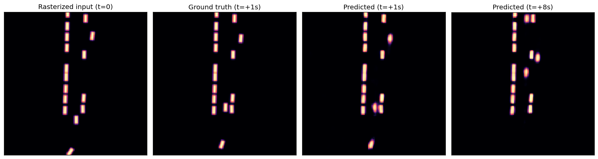

# Occupancy Flow Tutorial

| Metadata | Value |
|----------|-------|
| **Level** | Advanced |
| **Runtime** | ~10 min (CPU) |
| **Prerequisites** | WOD data, SceneContext types, JAX basics |
| **Format** | Python + Jupyter |

A Tier 3 Advanced tutorial demonstrating the full occupancy flow prediction
pipeline: rasterizing a real Waymo Open Dataset scene to a top-down grid,
running a Multi-Scale Fourier Neural Operator (FNO) to predict future agent
occupancy and flow vectors, and enforcing the continuity equation as a
physics-informed training loss.

## Files

- **Python Script**: [`examples/advanced/01_occupancy_flow_tutorial.py`](https://github.com/avitai/simulacrax/blob/main/examples/advanced/01_occupancy_flow_tutorial.py)
- **Jupyter Notebook**: [`examples/advanced/01_occupancy_flow_tutorial.ipynb`](https://github.com/avitai/simulacrax/blob/main/examples/advanced/01_occupancy_flow_tutorial.ipynb)

## Requirements & Run

1. Install dependencies: `uv sync`
2. Activate the managed environment: `source ./activate.sh`
3. Point at your WOD Motion TFRecords (once): add
   `WOD_MOTION_TFRECORD_PATH=/path/to/motion_v1.2.1/tf_example` to `.env.data`
4. Run: `python examples/advanced/01_occupancy_flow_tutorial.py`

## Prerequisites

- Simulacrax installed (`uv sync`)
- WOD Motion validation shard downloaded (see [Installation](../../getting-started/installation.md))
- `WOD_MOTION_TFRECORD_PATH` environment variable set

## What You'll Learn

1. Build a `SceneContext` from real WOD trajectory data using `WODSource`
2. Rasterize with `SceneRasterizer` — understand the 8-channel grid layout
3. Configure and run `OccupancyFlowModel` (MultiScaleFNO backbone)
4. Compute `FlowConsistencyLoss` (∂ρ/∂t + ∇·(ρv) = 0) as a training signal
5. Verify FNO resolution independence: same config at 64×64 and 128×128
6. (Bonus) Compare predictions against a classical diffusion-advection solver

## Pipeline Overview

```
WODSource → SceneContext
                ↓
SceneRasterizer.rasterize()
    ↓
OccupancyGrid (H, W, 8)
    Channels 0-2: vehicle / pedestrian / cyclist occupancy (Gaussian blobs)
    Channels 3-4: aggregate velocity field (vx, vy) in m/s
    Channels 5-7: road / crosswalk / traffic_signal map features
                ↓
OccupancyFlowModel  [MultiScaleFourierNeuralOperator]
                ↓
OccupancyGridPrediction
    .occupancy  (1, 8, 3, H, W)  ← future per-type occupancy ∈ [0, 1]
    .flow       (1, 8, H, W, 2)  ← predicted velocity field in m/s
                ↓
FlowConsistencyLoss.compute(pred)  → scalar physics loss
```

## Quick Usage

```python
from simulacrax.occupancy import (
    OccupancyFlowConfig, RasterizerConfig, SceneRasterizer,
    FlowConsistencyLoss, FlowConsistencyLossConfig,
    create_occupancy_flow_model,
)
from flax import nnx
import jax

# Rasterize
rasterizer = SceneRasterizer(RasterizerConfig(grid_resolution=128))
grid = rasterizer.rasterize(scene)  # SceneContext → OccupancyGrid

# Predict
config = OccupancyFlowConfig(grid_resolution=128)
model = create_occupancy_flow_model(config, nnx.Rngs(params=jax.random.key(0)))
prediction = model(grid)
# prediction.occupancy: (1, 8, 3, 128, 128)
# prediction.flow:      (1, 8, 128, 128, 2)

# Physics loss (cell size derived from the grid config)
loss_fn = FlowConsistencyLoss(
    FlowConsistencyLossConfig(weight=0.1, dt=0.5, cell_size_m=config.cell_size_m)
)
physics_loss = loss_fn.compute(prediction)
```

## Sister Repo Components

| Component | Source | Purpose |
|-----------|--------|---------|
| `MultiScaleFourierNeuralOperator` | opifex.neural.operators.fno.multiscale | FNO backbone |
| `WODSource` | simulacrax.data | Real WOD TFRecord loading |
| `solve_diffusion_advection_2d` | opifex.physics.solvers.diffusion_advection | Classical solver validation |

## Coming from Occupancy Grid Baselines?

If you're familiar with occupancy grid methods from motion prediction literature,
here's how Simulacrax compares:

| Baseline | Simulacrax |
|----------|------------|
| Fixed-size CNN grid | Resolution-independent FNO (same model at 64×64 or 256×256) |
| Hard voxelisation | Gaussian soft rasterization (differentiable, `jax.grad` through positions) |
| Occupancy only | Occupancy + flow vectors (continuity equation enforced) |
| PyTorch dataloader | `WODSource` + JAX arrays |
| Manual physics penalty | `FlowConsistencyLoss` enforces ∂ρ/∂t + ∇·(ρv) = 0 automatically |

## API References

- [`OccupancyFlowConfig` / `OccupancyFlowModel`](../../api/occupancy/flow_model.md)
- [`SceneRasterizer`](../../api/occupancy/rasterizer.md)
- [`FlowConsistencyLoss`](../../api/occupancy/losses.md)

## Example Output



*Rasterized input, predicted occupancy, and the rasterized ground-truth future.*
