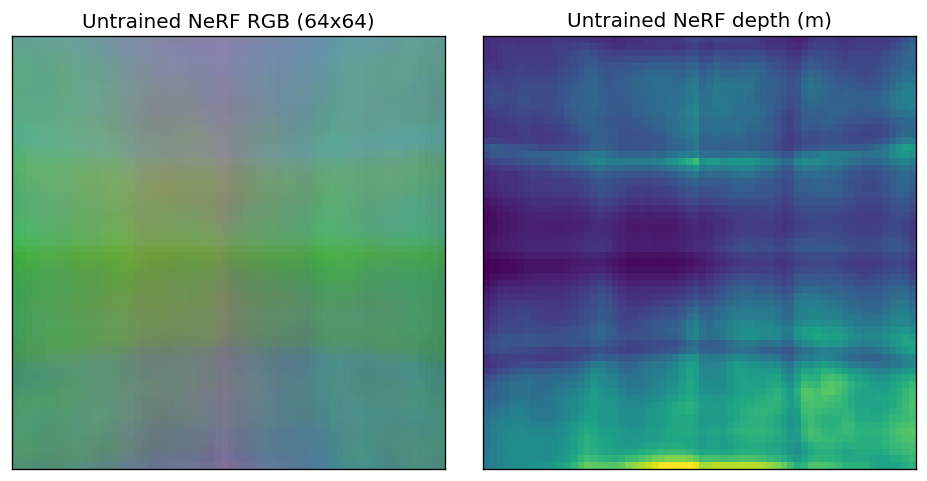
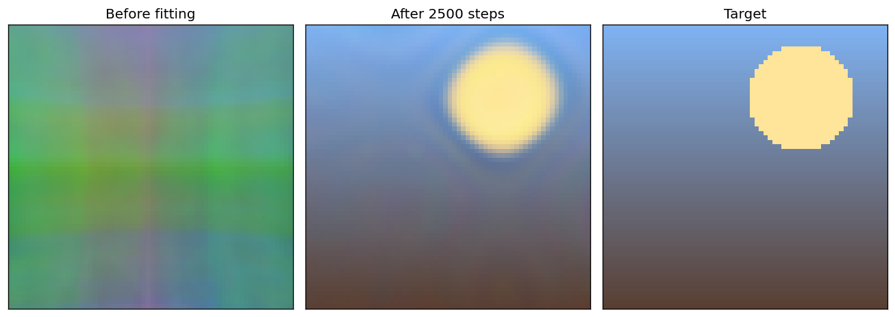
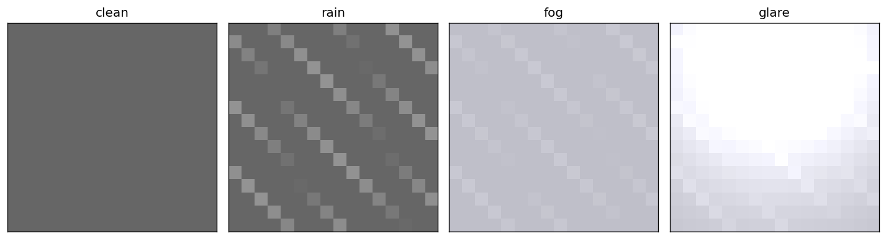
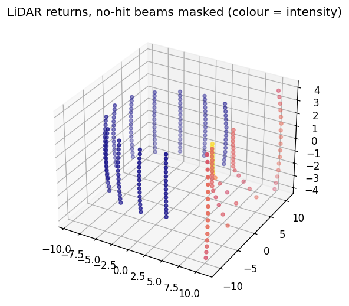

# Sensor Simulation Tutorial

| Metadata | Value |
|----------|-------|
| **Level** | Advanced |
| **Runtime** | ~5-10 min (GPU) |
| **Prerequisites** | JAX basics, ScenarioMiner Quick Reference |
| **Format** | Python + Jupyter |

A complete walkthrough of Simulacrax's differentiable sensor simulation stack:
NeRF-based RGB rendering, physics-inspired weather augmentations, and LiDAR
point cloud generation from voxel density grids.

## Files

- **Python Script**: [`examples/advanced/03_sensor_simulation_tutorial.py`](https://github.com/avitai/simulacrax/blob/main/examples/advanced/03_sensor_simulation_tutorial.py)
- **Jupyter Notebook**: [`examples/advanced/03_sensor_simulation_tutorial.ipynb`](https://github.com/avitai/simulacrax/blob/main/examples/advanced/03_sensor_simulation_tutorial.ipynb)

## Requirements & Run

1. Install dependencies: `uv sync`
2. Activate the managed environment: `source ./activate.sh`
3. Run: `python examples/advanced/03_sensor_simulation_tutorial.py` — no dataset required

## Prerequisites

- Simulacrax installed (`uv sync`)
- No dataset required — all examples use synthetic data

## What You'll Learn

1. Configure and run `NeRFRenderer` with opifex `SinusoidalEmbedding` + `StandardMLP`
2. Compute gradients through `render_scene` for photometric optimisation
3. Apply `RainAugmentation`, `FogAugmentation`, and `GlareAugmentation` individually
4. Compose weather operators into a pipeline with `CompositeOperatorModule`
5. Cast LiDAR beams through a voxel density grid with `LiDARRayCaster`
6. Connect `LiDARRayCaster` to `VoxelModel` (artifex) for realistic density fields

## Pipeline Overview

```
scene_context (ctx_len, context_dim)
        │
        ▼
NeRFRenderer.render_scene(scene_context, camera_pose)
        │
        ▼
RenderedImage
  ├── pixels (H, W, 3)  ← RGB in [0, 1]
  └── depth  (H, W)     ← per-pixel depth in world units
        │
        ▼
CompositeOperatorModule [SEQUENTIAL]
  ├── RainAugmentation   ← sinusoidal streak mask
  ├── FogAugmentation    ← Beer-Lambert scattering
  └── GlareAugmentation  ← Gaussian bloom
        │
        ▼
augmented image (H, W, 3)

voxel_density (R, R, R)   ← from jnp or artifex.VoxelModel
        │
        ▼
LiDARRayCaster.cast_rays(voxel, position, rotation, key)
        │
        ▼
PointCloud
  ├── points      (num_beams, 3)
  └── intensities (num_beams,)
```

## Quick Usage

```python
import jax
import jax.numpy as jnp
from flax import nnx

from simulacrax.sensor import (
    CameraPose, NeRFRenderer, NeRFRendererConfig,
    RainAugmentation, RainConfig,
    FogAugmentation, FogConfig,
    LiDARConfig, LiDARRayCaster,
)

# --- NeRF Renderer ---
cfg = NeRFRendererConfig(height=16, width=16, context_dim=64)
renderer = NeRFRenderer(cfg, rngs=nnx.Rngs(params=jax.random.key(0)))
scene_ctx = jax.random.normal(jax.random.key(1), (8, 64))
pose = CameraPose(position=jnp.zeros(3), rotation=jnp.eye(3))
result = renderer.render_scene(scene_ctx, pose)
# result.pixels: (16, 16, 3), result.depth: (16, 16)

# --- Weather Pipeline ---
image = jnp.full((16, 16, 3), 0.4)
rain = RainAugmentation(RainConfig(field_key="image"), rngs=nnx.Rngs(0))
fog  = FogAugmentation(FogConfig(field_key="image"),  rngs=nnx.Rngs(1))
data, _, _ = fog.apply(*rain.apply({"image": image}, {}, {}))

# --- LiDAR ---
caster = LiDARRayCaster(LiDARConfig(num_beams=64, max_range=20.0))
voxel = jnp.full((16, 16, 16), 0.4)
cloud = caster.cast_rays(voxel, jnp.zeros(3), jnp.eye(3), key=jax.random.key(0))
# cloud.points: (64, 3), cloud.intensities: (64,)
```

## Sister Repo Components

| Component | Source | Role |
|-----------|--------|------|
| `SinusoidalEmbedding` | `opifex.neural.operators.common.embeddings` | NeRF positional encoding |
| `StandardMLP` | `opifex.neural.base` | Scene projector + field MLP (`snake` activation) |
| `ModalityOperator` | `datarax.core.modality` | Base class for weather augmentations |
| `CompositeOperatorModule` | `datarax.operators.composite_operator` | Weather pipeline composition |
| `VoxelModel` | `artifex.generative_models.models.geometric.voxel` | 3-D occupancy grid source |

## API References

- [`NeRFRenderer` / `NeRFRendererConfig`](../../api/sensor/nerf_renderer.md)
- [`RainAugmentation` / `FogAugmentation` / `GlareAugmentation`](../../api/sensor/weather.md)
- [`LiDARRayCaster` / `LiDARConfig`](../../api/sensor/lidar.md)

## Example Output



*NeRF RGB and per-pixel depth render (untrained field).*



*Photometric fitting: the field converges to the target through the differentiable renderer.*


*Weather augmentation stages: clean, rain, fog, glare.*


*LiDAR returns tracing the demo scene's wall and box.*
