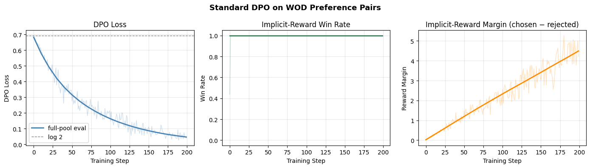
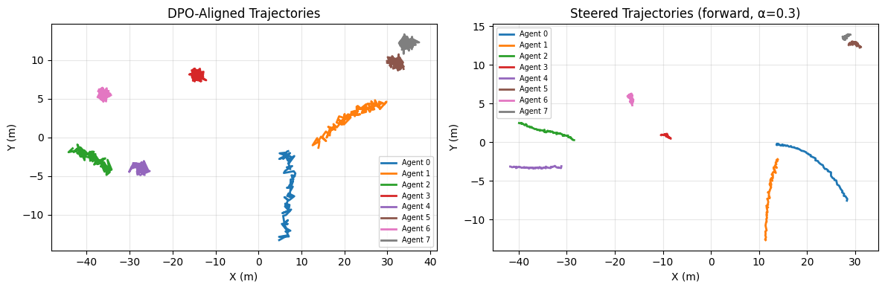

# DPO Fine-Tuning with Scenario Steering — Tutorial

| Metadata | Value |
|----------|-------|
| **Level** | Advanced |
| **Runtime** | ~30 min (GPU recommended) |
| **Prerequisites** | DPO Fine-Tuning Quick Reference, JAX arrays, preference basics |
| **Format** | Python + Jupyter |

A Tier 2 tutorial covering the complete DPO fine-tuning and scenario steering
workflow end-to-end. Extends the DPO quick reference with guided generation:
a technique for steering trajectory generation toward a target scenario type
(e.g. `"forward"`, `"lane_change"`) using a kinematic reward signal.

This tutorial runs on real Waymo Open Dataset preference pairs, so a WOD Motion
validation shard is required. Only the checkpoint-absent warm-up model is
synthetic; the preference pairs are built from real WOD trajectories.

## Files

- **Python Script**: [`examples/alignment/03_dpo_finetuning_tutorial.py`](https://github.com/avitai/simulacrax/blob/main/examples/alignment/03_dpo_finetuning_tutorial.py)
- **Jupyter Notebook**: [`examples/alignment/03_dpo_finetuning_tutorial.ipynb`](https://github.com/avitai/simulacrax/blob/main/examples/alignment/03_dpo_finetuning_tutorial.ipynb)

## Requirements & Run

1. Install dependencies: `uv sync`
2. Activate the managed environment: `source ./activate.sh`
3. Point at your WOD Motion TFRecords (once): add
   `WOD_MOTION_TFRECORD_PATH=/path/to/motion_v1.2.1/tf_example` to `.env.data`
4. Run: `python examples/alignment/03_dpo_finetuning_tutorial.py`

## What You'll Learn

1. Build preference pairs from synthetic trajectory candidates using `SafetyReward`
2. Run a plain DPO training loop and record alignment curves
3. Configure `ScenarioSteeringConfig` with target scenario and steering strength
4. Understand `compute_scenario_reward` for rule-based kinematic scoring
5. Execute `steer_step()` to blend DPO loss with scenario reward
6. Compare steered vs. unsteered trajectory distributions
7. Call `ScenarioMiner.steer()` for high-level steered generation

## Pipeline Overview

```
PreferenceBatch                ScenarioSteeringConfig
    |                                    |
    +-- to_dpo_batch()      target="forward", α=0.3
    |                                    |
    v                                    v
DPOAlignmentTrainer <──── ScenarioSteeringTrainer
    |                           |
    +-- compute_dpo_loss()      +-- compute_scenario_reward()
    |   (Monte Carlo)           |   (rule-based kinematic reward)
    v                           v
        steer_step() → DPOAlignmentMetrics
                              |
                              v
                    ScenarioMiner.steer()
```

## Steering Objective

Each steering step samples candidates from the current policy, ranks them by
scenario + safety reward, gates feasibility on road edges, and applies a
standard DPO update on the ranked chosen/rejected pairs. The selection
pressure α sets how tight the top/bottom pools are
(``ceil((1 − α) · num_feasible)``): higher α widens the reward gap between
pairs, and α = 0 pairs randomly (no steering).

| Parameter | Effect |
|-----------|--------|
| `α = 0.0` | Random pairing — plain DPO, no steering pressure |
| `α = 0.3` | Moderate selection pressure — recommended default |
| `α = 1.0` | Best-vs-worst pairing — maximum steering pressure |

## Steering Configuration

```python
from simulacrax.alignment import ScenarioSteeringConfig

config = ScenarioSteeringConfig(
    target_scenario="forward",   # kinematic target label
    steering_strength=0.3,        # selection pressure α ∈ [0.0, 1.0]
    num_steering_steps=1,         # gradient steps per ScenarioMiner.steer()
    num_candidates=8,             # candidates sampled per scene context
    feasibility_threshold=0.0,    # max off-road fraction for "chosen"
)
```

## Quick Usage

```python
from simulacrax.alignment import (
    DPOAlignmentConfig,
    DPOAlignmentTrainer,
    ScenarioSteeringConfig,
    ScenarioSteeringTrainer,
    create_reference_model,
)
from opifex.core.training.optimizers import create_optimizer, OptimizerConfig

# Build DPO trainer
tx = create_optimizer(OptimizerConfig(learning_rate=1e-3, gradient_clip=1.0))
optimizer = nnx.Optimizer(model, tx, wrt=nnx.Param)
dpo_trainer = DPOAlignmentTrainer(
    model=model,
    optimizer=optimizer,
    config=DPOAlignmentConfig(reference_free=True),
)

# Wrap with steering
steering_config = ScenarioSteeringConfig(
    target_scenario="forward",
    steering_strength=0.3,
)
steer_trainer = ScenarioSteeringTrainer(
    dpo_trainer=dpo_trainer,
    config=steering_config,
)

# Run steered training step
metrics = steer_trainer.steer_step(dpo_batch, jax.random.key(0))
```

## High-Level SDK

```python
from simulacrax.api.scenario_miner import create_scenario_miner
from simulacrax.alignment import ScenarioSteeringConfig
from simulacrax.api.config import MinerConfig

miner = create_scenario_miner(MinerConfig(...))
steered = miner.steer(
    scenario_type="forward",
    density="medium",
    steering_config=ScenarioSteeringConfig(
        target_scenario="forward",
        steering_strength=0.3,
        num_steering_steps=5,
    ),
    count=10,
)
```

## Prerequisites

- Simulacrax installed (`uv sync`)
- Familiarity with [DPO Fine-Tuning Quick Reference](dpo-finetuning-quickref.md)
- JAX arrays and basic understanding of preference-based alignment

## Related

- [DPO Fine-Tuning Quick Reference](dpo-finetuning-quickref.md)
- [Preference Construction Quick Reference](preference-construction-quickref.md)
- [ScenarioSteeringConfig API](../../api/alignment/scenario_steering.md)
- [DPOAlignmentTrainer API](../../api/alignment/dpo_trainer.md)
- [ScenarioMiner API](../../api/api/scenario_miner.md)
- [Alignment User Guide](../../user-guide/alignment.md)

## Example Output



*DPO loss, reward accuracy, and reward margin over training.*


*Sampled trajectories before and after scenario steering.*
