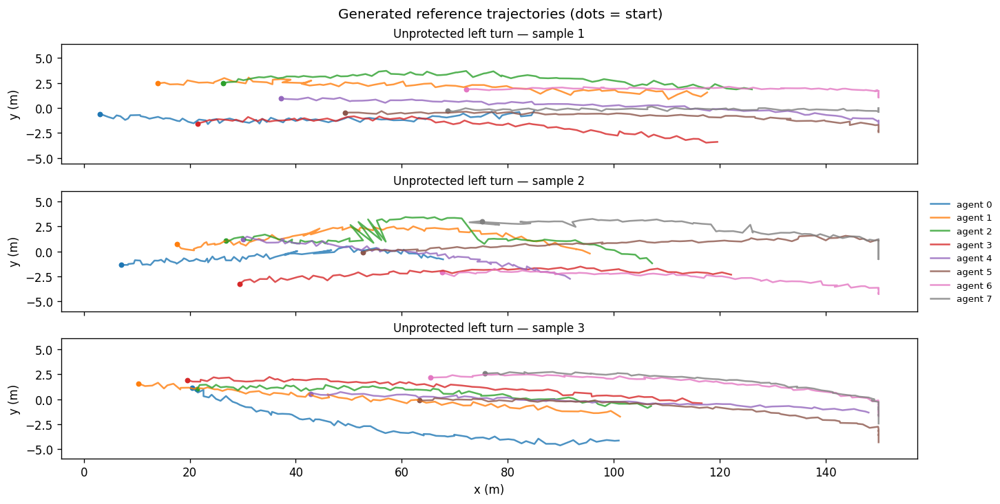

# End-to-End Quick Reference

| Metadata | Value |
|----------|-------|
| **Level** | Core |
| **Runtime** | ~2 min (CPU) |
| **Prerequisites** | DiffAV installed (`uv sync`) |
| **Format** | Python + Jupyter |

The "hello world" of DiffAV: generate synthetic driving scenarios,
evaluate a planner with ADE/FDE metrics, and search for adversarial failure
cases — all in under 15 lines of Python.

## Files

- **Python Script**: [`examples/core/03_end_to_end_quickref.py`](https://github.com/avitai/DiffAV/blob/main/examples/core/03_end_to_end_quickref.py)
- **Jupyter Notebook**: [`examples/core/03_end_to_end_quickref.ipynb`](https://github.com/avitai/DiffAV/blob/main/examples/core/03_end_to_end_quickref.ipynb)

## Requirements & Run

1. Install dependencies: `uv sync`
2. Activate the managed environment: `source ./activate.sh`
3. Run: `python examples/core/03_end_to_end_quickref.py` — no dataset required

## What You'll Learn

1. Create a `MinerConfig` and build a `ScenarioMiner` with `create_scenario_miner()`
2. Generate a batch of synthetic driving scenarios with `generate()`
3. Evaluate a planner function with `evaluate_planner()` — returns ADE and FDE
4. Find adversarial failure cases with `adversarial_search()` — sorted by severity

## Pipeline Overview

```
MinerConfig
    ↓
create_scenario_miner()
    ↓
generate(scenario_type, density, count)  →  list[Scenario]
    ↓
evaluate_planner(planner_fn, scenarios)  →  MetricsReport
    ↓
adversarial_search(planner_fn, budget)   →  list[FailureCase]
```

## Quick Usage

```python
from diffav.api import MinerConfig, create_scenario_miner
from diffav.core.types import TrajectoryPrediction
import jax.numpy as jnp

config = MinerConfig(max_agents=8, prediction_horizon=20, context_dim=64)
miner = create_scenario_miner(config)

# 1. Generate scenarios
scenarios = miner.generate("unprotected_left_turn", density="medium", count=5)

# 2. Evaluate a planner
def my_planner(context):
    n = len(context.agent_states)
    return TrajectoryPrediction(
        trajectories=jnp.zeros((n, config.prediction_horizon, 4)),
        agent_ids=tuple(f"agent_{i}" for i in range(n)),
    )

report = miner.evaluate_planner(my_planner, scenarios)
print(report.metric_values)  # {'ade': X.XXXX, 'fde': X.XXXX}

# 3. Find failure cases
cases = miner.adversarial_search(my_planner, budget=3)
for fc in cases:
    print(fc.failure_mode, fc.severity)
```

## API References

- [`ScenarioMiner`](../../api/api/scenario_miner.md)
- [`MinerConfig`, `Scenario`, `FailureCase`](../../api/api/config.md)
- [ScenarioMiner User Guide](../../user-guide/sdk.md)

## Example Output



*Generated reference trajectories for three scenarios (dots mark starts).*
