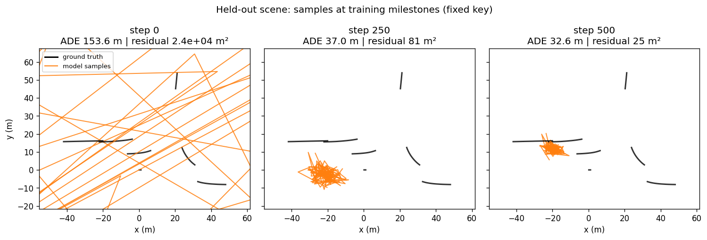
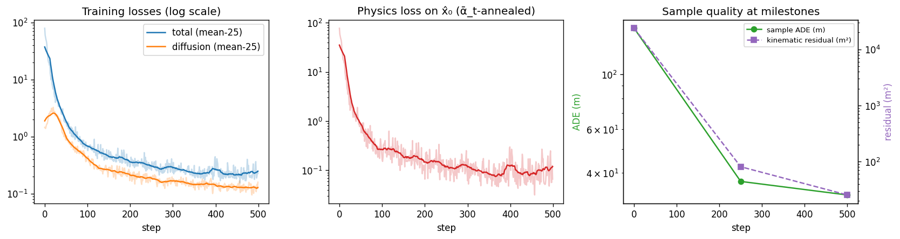

# Physics-Informed Training Tutorial

| Metadata | Value |
|----------|-------|
| **Level** | Intermediate |
| **Runtime** | ~5-8 min (GPU) |
| **Prerequisites** | Trajectory diffusion model basics, bicycle model, JAX/Flax NNX |
| **Format** | Python + Jupyter |

A Tier 2 tutorial demonstrating the physics-informed training loop that
combines diffusion loss with kinematic and collision penalties. The trainer
uses adaptive weight scheduling to gradually increase the physics loss
contribution during training, Min-SNR-γ weighting on the diffusion term, and
an ᾱ_t anneal on the physics term. The model is conditioned on per-agent
scene context rows standardized to unit scale — the same add/div coefficient
practice the reference trajectory diffusers apply to conditioning features.
Training milestones sample a held-out scene so the loss decrease is tied to
visible sample improvement.

## Files

- **Python Script**: [`examples/models/02_physics_informed_training_tutorial.py`](https://github.com/avitai/simulacrax/blob/main/examples/models/02_physics_informed_training_tutorial.py)
- **Jupyter Notebook**: [`examples/models/02_physics_informed_training_tutorial.ipynb`](https://github.com/avitai/simulacrax/blob/main/examples/models/02_physics_informed_training_tutorial.ipynb)

## Requirements & Run

1. Install dependencies: `uv sync`
2. Activate the managed environment: `source ./activate.sh`
3. Point at your WOD Motion TFRecords (once): add
   `WOD_MOTION_TFRECORD_PATH=/path/to/motion_v1.2.1/tf_example` to `.env.data`
4. Run: `python examples/models/02_physics_informed_training_tutorial.py`

## What You'll Learn

1. Configure a `TrajectoryTrainer` with physics-informed training
2. Set up adaptive weight scheduling for physics loss
3. Run training steps and observe loss and physics weight evolution
4. Connect the loss decrease to sample quality at training milestones
5. Use JIT-compiled training for maximum throughput
6. Run epoch-based training with data iterators

## Prerequisites

- Simulacrax installed (`uv sync`)
- Trajectory diffusion model basics, bicycle model, JAX/Flax NNX

## Pipeline Overview

```
TrajectoryDiffusionModel + SimulacraxPhysicsLoss
    |                         |
    +-- compute_loss()        +-- kinematic + collision penalties
    |                         |
    v                         v
TrajectoryTrainer
    |-- train_step()        -> TrainingStepMetrics
    |-- train_epoch()       -> [TrainingStepMetrics, ...]
    +-- compute_train_step() -> (loss, aux)  [JIT-compatible]
```

## Quick Usage

```python
from simulacrax.models.trainer import TrainerConfig, TrajectoryTrainer
from simulacrax.models.trajectory_diffusion import (
    TrajectoryDiffusionConfig, TrajectoryDiffusionModel,
)
from simulacrax.physics.losses import SimulacraxPhysicsConfig

trainer_config = TrainerConfig(
    physics_config=SimulacraxPhysicsConfig(
        kinematic_weight=1.0, collision_weight=1.0,
        adaptive_weighting=True, initial_physics_weight=0.01,
    ),
    num_epochs=100,
)
trainer = TrajectoryTrainer(model, trainer_config)
metrics = trainer.train_step(trajectories, scene_context, key=key)
```

## Sister Repo Components

| Component | Source | Purpose |
|-----------|--------|---------|
| `OptimizerConfig` | opifex | Optimizer + gradient clipping config |
| `create_optimizer` | opifex | Build optax optimizer from config |
| `ErrorRecoveryManager` | opifex | NaN/instability detection |
| `TimingCollector` | calibrax | Wall-clock timing |
| `SimulacraxPhysicsLoss` | simulacrax | Bicycle model + collision penalties |

## Coming from Diffuser / Standard Training Loops?

If you're familiar with standard PyTorch training loops, here's how Simulacrax physics-informed training compares:

| PyTorch / Diffuser | Simulacrax |
|--------------------|------------|
| Manual `loss.backward()` + `optimizer.step()` | `TrajectoryTrainer.train_step(traj, ctx, key)` |
| Physics penalty as separate loss term | `SimulacraxPhysicsLoss` integrated via `TrainerConfig` |
| Manual gradient clipping | Pre-configured via `OptimizerConfig(gradient_clip=...)` |
| Custom NaN handling | `nan_safe_gradients()` utility in training loop |
| `torch.compile(model)` | `nnx.jit(trainer.compute_train_step)` |

**Key differences:**

1. **Adaptive weighting**: Physics loss weight ramps from `initial_physics_weight` to 1.0 over training — no manual tuning needed
2. **NaN-safe by default**: Gradients are zeroed if NaN detected, preventing silent divergence
3. **Functional state**: Optimizer state flows explicitly; no hidden `optimizer.zero_grad()` calls needed

## Related

- [Trajectory Diffusion Quick Reference](trajectory-diffusion-quickref.md)
- [Bicycle Model Quick Reference](../physics/bicycle-model-quickref.md)
- [TrajectoryTrainer API](../../api/models/trainer.md)
- [SimulacraxPhysicsLoss API](../../api/physics/losses.md)

## Example Output



*Held-out scene, fixed sampling key: at step 0 the samples are data-scale
noise crossing the whole frame; by the midpoint they contract to the data's
spatial scale, and by the final milestone they anchor near the conditioned
agents' ground-truth tracks while the kinematic residual falls by three
orders of magnitude. Every change between panels comes from the trained
weights.*



*Left: Min-SNR-weighted diffusion and total losses. Middle: ᾱ_t-annealed
physics loss on the x̂₀ reconstruction. Right: what the loss decrease buys —
displacement error and kinematic residual of samples at the milestones.*
