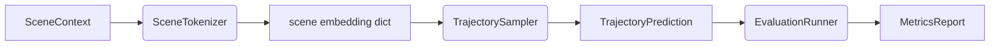

# Core Concepts

DiffAV is built around immutable domain types, protocol-based dependency inversion,
and integration with the datarax data pipeline ecosystem.

## Domain Types

All data containers are frozen dataclasses with `slots=True` and `kw_only=True`
for performance and safety. They are defined in `diffav.core.types`.

### AgentState

Snapshot of a single traffic participant's kinematic state:

```python
@dataclass(frozen=True, slots=True, kw_only=True)
class AgentState:
    position: jax.Array    # [x, y], shape (2,)
    heading: float         # radians
    velocity: float        # m/s
    acceleration: float    # m/s^2
    agent_type: AgentType  # VEHICLE | PEDESTRIAN | CYCLIST
```

### SceneContext

A complete driving scene combining ego, surrounding agents, map, and timestamps:

```python
@dataclass(frozen=True, slots=True, kw_only=True)
class SceneContext:
    ego_state: AgentState
    agent_states: tuple[AgentState, ...]
    map_features: tuple[MapFeature, ...]
    timestamps: jax.Array  # shape (num_steps,)
```

### MapFeature

Polyline representation of a map element (lane, crosswalk, or traffic signal):

```python
@dataclass(frozen=True, slots=True, kw_only=True)
class MapFeature:
    polyline_points: jax.Array   # shape (num_points, 2)
    feature_type: MapFeatureType  # LANE | CROSSWALK | TRAFFIC_SIGNAL
```

### TrajectoryPrediction

Container for predicted future trajectories with state dimensions
`[x, y, heading, velocity]`:

```python
@dataclass(frozen=True, slots=True, kw_only=True)
class TrajectoryPrediction:
    trajectories: jax.Array      # (num_agents, future_steps, 4)
    agent_ids: tuple[str, ...]
```

## The Model Seam

The evaluation pipeline is decoupled from concrete model classes through one
consumer-side protocol, `diffav.evaluation.TrajectorySampler`: anything
with a `sample(scene_context, *, key) -> TrajectoryPrediction`
method can be evaluated. `TrajectoryDiffusionModel` satisfies it
structurally — no inheritance required — and tests can pass lightweight
stubs.



## datarax Integration

`WODSource` extends datarax's `DataSourceModule`, following the
`TFDSEagerSource`/`TFDSStreamingSource` pattern with two loading modes:

- **Config**: `WODSourceConfig` extends `StructuralConfig` (frozen, validated)
- **Iterator**: Yields datarax `Element` objects with `data`, `state`, and `metadata`
- **Modes**: `"eager"` (load all at init, release TF) or `"streaming"` (lazy prefetch)
- **Ecosystem**: Compatible with datarax batchers, operators, samplers, and the pipeline API

```python
import os

from dotenv import load_dotenv

from diffav.data.wod_source import WODSource, WODSourceConfig

load_dotenv()

config = WODSourceConfig(
    wod_path=os.environ["WOD_MOTION_TFRECORD_PATH"],
    split="val",
    mode="eager",
)
source = WODSource(config)

# Standard iteration yields Element objects
for element in source:
    raw_scenario = element.data
    scenario_id = element.metadata["scenario_id"]
```

## Configuration

Each module owns its configuration dataclass next to the code it configures:

| Config | Module | Purpose |
|--------|--------|---------|
| `WODSourceConfig` | `data.wod_source` | WOD path, split, loading mode |
| `TokenizerConfig` | `data.tokenizer` | Modality modes, embedding dims |
| `TrajectoryDiffusionConfig` | `models.trajectory_diffusion` | Backbone size, timesteps, scale contract |
| `TrainerConfig` | `models.trainer` | Learning rate, physics weight, stability policy |
| `MinerConfig` | `api.config` | SDK entry-point settings |

All configs are frozen dataclasses that validate constraints in
`__post_init__` — via the shared validators in `diffav.core.config` —
and raise `ValueError` on invalid inputs.
