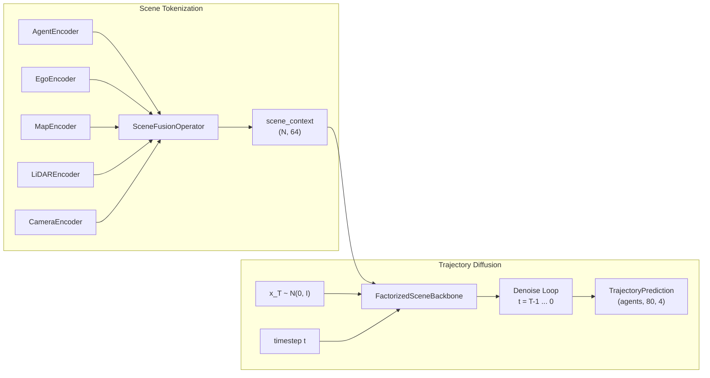

# Trajectory Generation Models

Simulacrax generates multi-agent future trajectories using denoising diffusion
probabilistic models (DDPM). This guide explains the architecture, how it
connects to the rest of the pipeline, and how to configure it for different
use cases.

## Architecture Overview

The trajectory generation pipeline has two stages:

1. **Scene tokenization** — `SceneTokenizer` encodes agents, map,
   and sensor data into a fused scene context embedding
2. **Trajectory diffusion** — `TrajectoryDiffusionModel` generates
   future trajectories conditioned on the scene context



## Diffusion Models for Trajectory Prediction

Diffusion models learn to generate data by reversing a gradual noising process.
Applied to trajectory prediction, this means:

**Forward process (training):** Ground-truth future trajectories are progressively
corrupted with Gaussian noise over $T$ timesteps. At each step, a small amount
of noise is added according to a variance schedule $\beta_t$.

**Reverse process (inference):** Starting from pure noise $x_T \sim \mathcal{N}(0, I)$,
the model iteratively predicts and removes noise to recover clean trajectories.
The FactorizedSceneBackbone conditions this denoising on scene context, so the
generated trajectories reflect the road geometry, surrounding agents, and traffic
state.

**Why diffusion?** Unlike deterministic regressors that output a single "best"
trajectory, diffusion models are generative — they can produce diverse, multimodal
predictions capturing the inherent uncertainty of driving (e.g., turn left vs.
go straight vs. turn right). This is critical for realistic simulation.

## FactorizedSceneBackbone

The score network that predicts noise at each diffusion step is a factorized
temporal + social backbone with the following structure:

| Layer | Description |
|-------|-------------|
| Input projection | `state_dim` (4) to `hidden_dim` |
| Positional encoding | Learnable, up to `num_agents_max * future_steps` tokens |
| Conditioning | Per-agent scene context + timestep drive adaptive layer norm (adaLN) modulation |
| Factorized blocks | Temporal attention (per agent over time), then social attention (per timestep across agents), then feed-forward — all adaLN-gated |
| Output head | adaLN-modulated LayerNorm + linear projection back to `state_dim` |

The backbone processes each agent's future as a temporal sequence and, at every
timestep, lets agents attend across one another. For 32 agents with 80 future
steps, each temporal pass attends over 80 tokens per agent and each social pass
attends over 32 tokens per timestep.

Adaptive layer norm (adaLN) is the key conditioning mechanism: the per-agent
scene context and the diffusion timestep produce the shift, scale, and residual
gate applied inside every attention and feed-forward sublayer, so trajectory
generation reflects the full scene context (road layout, traffic signals, other
agents) without concatenating these heterogeneous inputs.

The factorized blocks optionally add a third axis — map cross-attention,
gated by `use_map_cross_attention` (default `False` in the base config) — so
each token can attend to map tokens directly; the map-conditioned entrypoint is
`MapConditionedTrajectoryModel`.

## Configuration

`TrajectoryDiffusionConfig` controls all model parameters:

```python
from simulacrax.models.trajectory_diffusion import TrajectoryDiffusionConfig

config = TrajectoryDiffusionConfig(
    # Backbone architecture
    hidden_dim=128,               # Hidden dimension
    num_blocks=2,                 # Factorized blocks
    num_temporal_layers=2,        # Temporal attention sublayers per block
    num_social_layers=1,          # Social attention sublayers per block
    use_social_interaction=True,  # Agents attend across one another
    num_heads=4,                  # Attention heads
    mlp_ratio=4.0,                # FFN expansion ratio

    # Trajectory dimensions
    future_steps=80,      # 8 seconds at 10 Hz
    num_agents_max=32,    # Maximum agents per scene
    state_dim=4,          # [x, y, heading, velocity]
    context_dim=64,       # Scene embedding dimension

    # Diffusion schedule
    noise_schedule_type="cosine",
    num_timesteps=1000,
    beta_start=1e-4,
    beta_end=2e-2,

    # Training
    loss_type="mse",      # or "l1"
    dropout_rate=0.0,
)
```

### Model Variants

| Variant | hidden_dim | num_blocks | num_heads | Parameters | Use Case |
|---------|-----------|------------|-----------|------------|----------|
| Small | 64 | 1 | 2 | ~167K | Unit tests, prototyping |
| Base | 128 | 2 | 4 | ~1.15M | Development, ablations |
| Large | 256 | 4 | 8 | ~8.7M | Full-scale training |

### Noise Schedules

The noise schedule controls how quickly signal is destroyed during forward
diffusion. Available options:

- **`cosine`** (recommended) — smooth degradation, better for shorter sequences
- **`linear`** — standard DDPM schedule
- **`quadratic`** — faster noise increase
- **`sqrt`** — slower initial noise increase

## Training

Training minimizes the epsilon-matching objective: predict the noise added to
a trajectory at a random timestep.

```python
import jax
from flax import nnx

from simulacrax.models.trajectory_diffusion import (
    TrajectoryDiffusionModel,
    TrajectoryDiffusionConfig,
)

config = TrajectoryDiffusionConfig(hidden_dim=128, num_blocks=2, num_heads=4)
model = TrajectoryDiffusionModel(config, rngs=nnx.Rngs(params=jax.random.key(0)))

# Single training step
def loss_fn(m):
    return m.compute_loss(trajectories, scene_context, key=jax.random.key(1))

loss, grads = nnx.value_and_grad(loss_fn)(model)
```

The loss is fully differentiable through the FactorizedSceneBackbone, enabling
standard gradient-based optimization with `optax`.

## Inference

Generate trajectories by running the full reverse diffusion process:

```python
prediction = model.sample(
    scene_context,
    key=jax.random.key(42),
)

# prediction.trajectories: (32, 80, 4) — [x, y, heading, velocity]
# prediction.agent_ids: ("agent_0", "agent_1", ..., "agent_31")
```

With 1000 diffusion steps, inference requires 1000 sequential forward passes
through the backbone. The loop runs under `jax.lax.scan`, so JIT compile time
stays constant in `num_timesteps`. For faster sampling, reduce `num_timesteps`
in the config (e.g., 50 steps for development).

The model consumes trajectories at whatever scale the data pipeline emits —
WOD scenarios are ego-centred metres, so the reverse process applies no
clamp to its clean-trajectory estimate by default. For data normalised to a
known range, set `x0_clip_bound` (e.g. `1.0` for unit-scale inputs) to gain
the standard DDPM stabilisation clamp.

`sample()` also accepts an optional test-time guidance seam: pass a
single `guidance=GuidanceSpec(reward_fn=R, scale=η)` argument (a
differentiable scalar reward `reward_fn` and non-zero `scale` η), and
each reverse step ascends the reward in x̂₀-space
(`x̂₀ + η·ᾱ_t·∇R(x̂₀)`, non-finite gradients skipped). The alignment
package builds steering rewards for this seam via
`make_steering_guidance`.

## Connection to Artifex

The model composes two artifex primitives:

- **`NoiseSchedule`** from `artifex.generative_models.core.noise_schedule` —
  implements the forward diffusion math ($q$-sampling, posterior computation)
- **`FeedForwardNetwork`** from `artifex.generative_models.core.layers.transformers`,
  the DiT primitives `TimestepEmbedder`, `modulate`, and
  `get_1d_sincos_pos_embed` from `artifex.generative_models.models.backbones.dit`,
  and `flax.nnx.MultiHeadAttention` — the attention, feed-forward, and
  timestep/positional building blocks of the backbone

The model does not wrap `DDPMModel` directly because artifex's backbone factory
uses a closed registry that doesn't support custom backbones. This is documented
as a future improvement — once artifex adds an open backbone registry,
`TrajectoryDiffusionModel` can inherit from `DDPMModel` and gain DDIM sampling,
EMA, and distillation automatically.

## Related

- [Trajectory Diffusion Quick Reference](../examples/models/trajectory-diffusion-quickref.md) — runnable example
- [TrajectoryDiffusionModel API](../api/models/trajectory_diffusion.md)
- [FactorizedSceneBackbone API](../api/models/factorized_backbone.md)
- [TrajectoryPrediction](../api/core/types.md)
